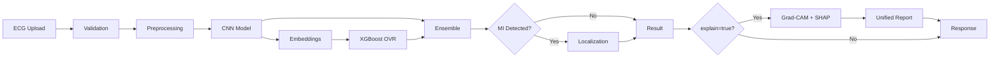

<p align="center">
  <h1 align="center">❤️ CardioGuard-AI</h1>
  <p align="center">
    <strong>Explainable AI-Powered 12-Lead ECG Analysis Platform</strong><br>
    Multi-label Cardiac Pathology Detection | MI Localization | Grad-CAM & SHAP Explanations
  </p>
</p>

<p align="center">
  
  
  
  
  
  
</p>

<p align="center">
  
  
</p>

---

## 🎯 Overview

**CardioGuard-AI** is an advanced clinical decision support system that analyzes 12-lead ECG signals to detect cardiac abnormalities with explainable AI. Unlike traditional "black-box" models, CardioGuard-AI provides transparent, interpretable predictions through Grad-CAM heatmaps and SHAP feature analysis.

### Key Capabilities

| Feature | Description |
|:--------|:------------|
| 🔬 **Multi-label Classification** | Simultaneous detection of MI, STTC, CD, HYP pathologies |
| 📍 **MI Localization** | Anatomical localization to 5 regions (AMI, ASMI, ALMI, IMI, LMI) |
| 🧠 **Hybrid Ensemble** | CNN + XGBoost OVR architecture with 50/50 weighted averaging |
| 💡 **Explainable AI** | Grad-CAM temporal saliency + SHAP feature contributions |
| 🔒 **Safety-First** | Fail-closed startup, input validation, path traversal protection |
| 📊 **Unified Reports** | Combined XAI artifacts with clinical narrative generation |

---

## 🏗️ Architecture

```
┌─────────────────────────────────────────────────────────────────┐
│                         CardioGuard-AI                          │
├─────────────────────────────────────────────────────────────────┤
│  ┌──────────────┐    ┌──────────────┐    ┌──────────────────┐  │
│  │   Frontend   │───▶│  Backend API │───▶│ Inference Engine │  │
│  │  React 19    │    │   FastAPI    │    │  PyTorch+XGBoost │  │
│  │  TypeScript  │◀───│   Pydantic   │◀───│  Grad-CAM+SHAP   │  │
│  └──────────────┘    └──────────────┘    └──────────────────┘  │
│         │                   │                     │             │
│         ▼                   ▼                     ▼             │
│  ┌─────────────────────────────────────────────────────────┐   │
│  │                    File System                           │   │
│  │  checkpoints/  │  artifacts/  │  reports/xai/runs/      │   │
│  └─────────────────────────────────────────────────────────┘   │
└─────────────────────────────────────────────────────────────────┘
```

### System Flow



---

## 📊 Model Performance

Trained and validated on the **PTB-XL dataset** (21,837 ECG records, 18,885 patients).

| Metric | Value |
|:-------|:------|
| **Macro AUROC** | 0.8998 |
| **Macro AUPRC** | 0.7278 |
| **Macro F1** | 0.6302 |

### Per-Class Performance

| Class | AUROC | AUPRC | F1 | Description |
|:------|:-----:|:-----:|:---:|:------------|
| **MI** | 0.9022 | 0.7795 | 0.6933 | Myocardial Infarction |
| **STTC** | 0.9193 | 0.7497 | 0.6638 | ST/T Change |
| **CD** | 0.8923 | 0.7738 | 0.6794 | Conduction Disturbance |
| **HYP** | 0.8805 | 0.6201 | 0.4844 | Hypertrophy |

---

## 🚀 Quick Start

### Prerequisites

- Python 3.10+
- Node.js 18+
- CUDA (optional, for GPU acceleration)

### Installation

```bash
# Clone the repository
git clone https://github.com/yourusername/CardioGuard-AI.git
cd CardioGuard-AI

# Create virtual environment
python -m venv .venv
.venv\Scripts\activate  # Windows
# source .venv/bin/activate  # Linux/Mac

# Install Python dependencies
pip install -r requirements.txt
pip install fastapi uvicorn  # API dependencies

# Install frontend dependencies
cd frontend
npm install
cd ..
```

### Running the Application

**1. Start the Backend API:**
```bash
uvicorn src.backend.main:app --host 0.0.0.0 --port 8000 --reload
```

Expected output:
```
Validating checkpoints...
Checkpoint validation passed!
Models loaded: Superclass=OK, Localization=True, XGB=4
INFO: Uvicorn running on http://0.0.0.0:8000
```

**2. Start the Frontend (in a new terminal):**
```bash
cd frontend
npm run dev
```

Expected output:
```
VITE v6.2.0 ready in 500ms
➜ Local: http://localhost:5173/
```

**3. Open in Browser:**
Navigate to `http://localhost:5173` and upload an ECG file (.npy or .npz format).

---

## 📁 Project Structure

```
CardioGuard-AI/
├── src/                          # Python source code
│   ├── backend/                  # FastAPI REST API
│   │   └── main.py              # API endpoints, validation
│   ├── models/                   # Neural network definitions
│   │   └── cnn.py               # ECGBackbone, ECGCNN
│   ├── pipeline/
│   │   ├── inference/           # Prediction orchestration
│   │   │   ├── run_inference_superclass.py  # Main orchestrator
│   │   │   └── run_inference_localization.py
│   │   └── training/            # Model training scripts
│   ├── xai/                     # Explainability modules
│   │   ├── gradcam.py           # Grad-CAM implementation
│   │   ├── shap_ovr.py          # SHAP for XGBoost
│   │   └── unified.py           # Unified explainer
│   └── utils/                   # Helpers and utilities
├── frontend/                    # React 19 + Vite + TypeScript
│   ├── lib/
│   │   ├── api.ts              # API client
│   │   └── types.ts            # TypeScript interfaces
│   └── components/             # React components
├── checkpoints/                 # Trained model weights
│   ├── ecgcnn_superclass.pt    # Superclass CNN
│   └── ecgcnn_localization.pt  # Localization CNN
├── logs/
│   └── xgb_superclass/         # XGBoost models per class
├── artifacts/
│   └── thresholds_superclass.json
├── tests/                       # Pytest test suite
├── docs/                        # Documentation
└── requirements.txt
```

---

## 🔌 API Reference

### Endpoints

| Method | Endpoint | Description |
|:-------|:---------|:------------|
| `POST` | `/predict/superclass` | Multi-label classification |
| `POST` | `/predict/mi-localization` | MI anatomical localization |
| `GET` | `/runs/{run_id}/{file_path}` | Serve XAI artifacts |
| `GET` | `/health` | Health check |
| `GET` | `/ready` | Readiness check |

### Superclass Prediction Request

```bash
curl -X POST "http://localhost:8000/predict/superclass" \
  -F "file=@sample.npy" \
  -F "explain=true"
```

### Response Schema

```json
{
  "mode": "superclass",
  "probabilities": {
    "MI": 0.85,
    "STTC": 0.12,
    "CD": 0.08,
    "HYP": 0.05,
    "NORM": 0.15
  },
  "predicted_labels": ["MI"],
  "primary": {
    "label": "MI",
    "confidence": 0.85,
    "rule": "priority_order"
  },
  "xai": {
    "enabled": true,
    "run_id": "20260131_142530_abc123",
    "artifacts": [
      {"type": "gradcam", "url": "/runs/.../gradcam.png"},
      {"type": "shap", "url": "/runs/.../shap.png"}
    ]
  }
}
```

---

## 🧪 Testing

```bash
# Run all tests
pytest tests/ -v

# Run specific test
pytest tests/test_consistency_guard.py -v
```

### Test Coverage

| Test File | Coverage |
|:----------|:---------|
| `test_consistency_guard.py` | Consistency checking logic |
| `test_airesult_mapper.py` | Response mapping |
| `test_checkpoint_validation.py` | Model validation |
| `test_data.py` | Data loading, splits |
| `test_gradcam.py` | Grad-CAM generation |
| `test_xgb_pipeline.py` | XGBoost inference |

---

## 📖 Documentation

Comprehensive documentation is available in the `docs/` directory:

| Document | Description |
|:---------|:------------|
| [00_repo_map.md](docs/00_repo_map.md) | Repository structure and discovery |
| [01_architecture.md](docs/01_architecture.md) | System architecture (C4 model) |
| [02_api_contracts.md](docs/02_api_contracts.md) | API specifications |
| [03_inference_pipeline.md](docs/03_inference_pipeline.md) | Detailed pipeline analysis |
| [04_xai_and_artifacts.md](docs/04_xai_and_artifacts.md) | XAI implementation details |
| [05_frontend_integration.md](docs/05_frontend_integration.md) | Frontend-backend integration |
| [TECHNICAL_REPORT.md](docs/TECHNICAL_REPORT.md) | Technical report |

---

## 🔬 Technical Details

### CNN Architecture

```
Input: (batch, 12, T) - 12-lead ECG signal

ECGBackbone:
├── Conv1d(12, 64, kernel=7) + BatchNorm + ReLU + Dropout
├── [ResidualBlock × 4]
├── AdaptiveAvgPool1d(1)
└── Output: (batch, 64) embeddings

Classification Head:
├── Linear(64, 4)
└── Sigmoid → Multi-label probabilities
```

### Ensemble Strategy

- **CNN:** Learns temporal patterns from raw signal
- **XGBoost OVR:** Works on 64-dim CNN embeddings
- **Fusion:** `ensemble = 0.5 × CNN + 0.5 × XGBoost`

### XAI Pipeline

1. **Grad-CAM:** Generates temporal saliency maps showing where the model focuses
2. **SHAP:** Computes feature contributions from XGBoost
3. **Unified Explainer:** Synthesizes both into coherent clinical narrative
4. **Sanity Checker:** Validates XAI output quality

---

## ⚠️ Medical Disclaimer

> **CardioGuard-AI is intended for research and educational purposes only.**
> 
> This system should NOT be used as a standalone diagnostic tool in clinical settings. All predictions require independent verification by qualified healthcare professionals. The developers assume no liability for clinical decisions made based on this system's outputs.

---

## 🛣️ Roadmap

| Version | Timeline | Features |
|:--------|:---------|:---------|
| v1.1 | Short-term | Consistency Guard integration |
| v1.2 | Short-term | Expert review interface |
| v2.0 | Mid-term | RAG integration, uncertainty estimation |
| v2.x | Long-term | Real-time streaming, enterprise dashboard |

---

## 📚 References

- **Dataset:** [PTB-XL](https://physionet.org/content/ptb-xl/1.0.1/) - Large ECG dataset
- **Grad-CAM:** Selvaraju et al., "Grad-CAM: Visual Explanations from Deep Networks"
- **SHAP:** Lundberg & Lee, "A Unified Approach to Interpreting Model Predictions"

---

## 🤝 Contributing

Contributions are welcome! Please read our contributing guidelines before submitting a PR.

---

## 📄 License

This project is licensed for research and educational use. See the LICENSE file for details.

---

<p align="center">
  <strong>CardioGuard-AI</strong> — Bridging AI and Clinical Decision Making
</p>
