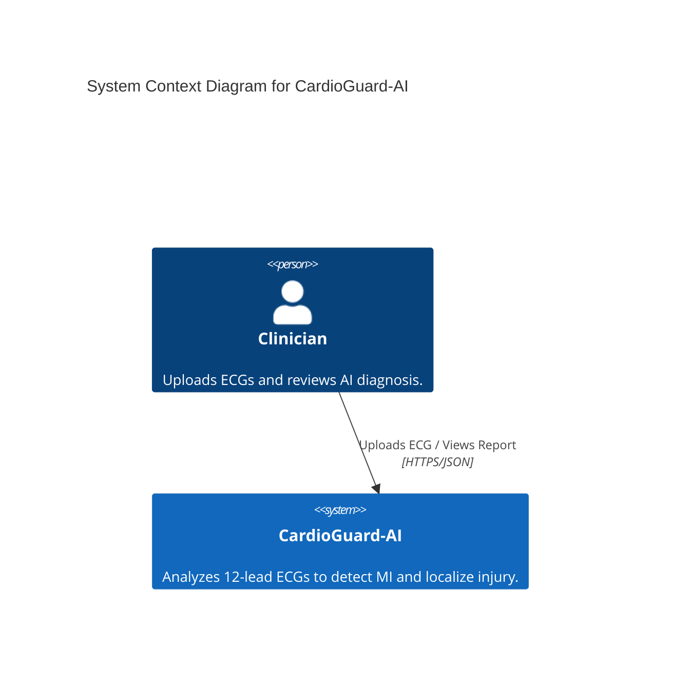
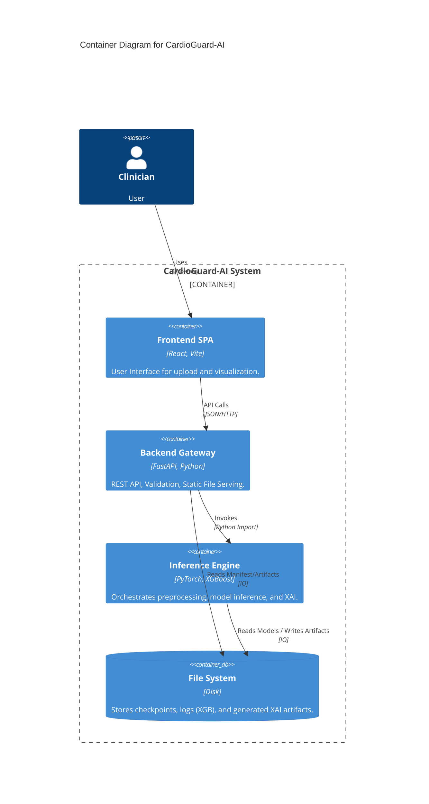
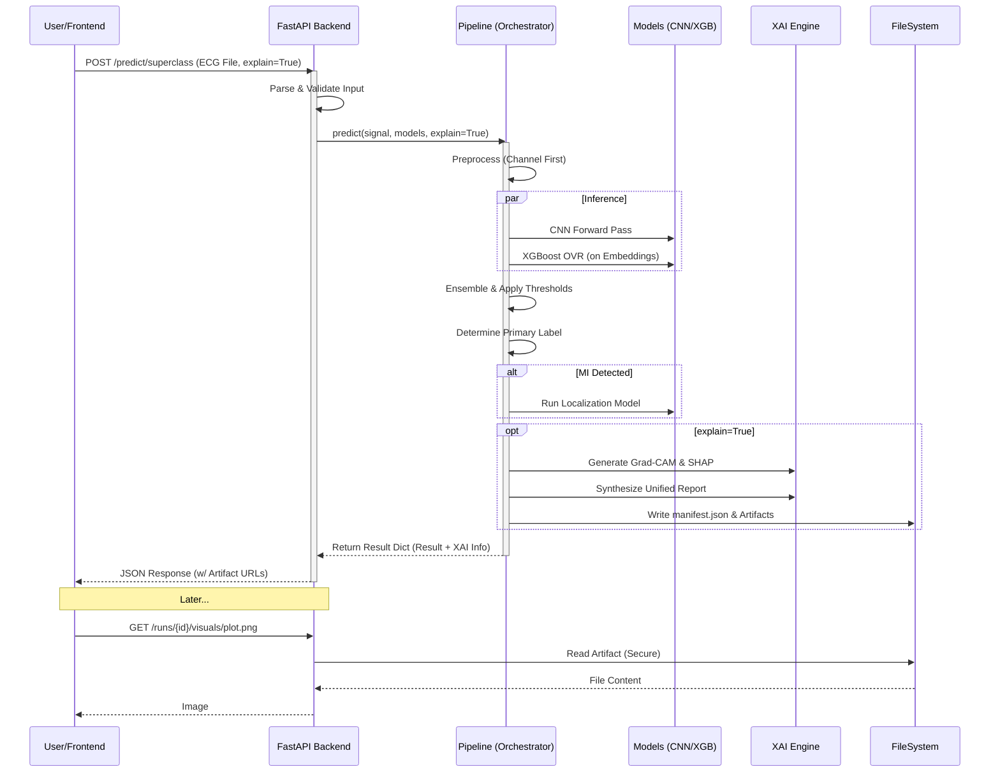

# Phase 1: Architecture & Data Flow

**Generated Date:** 2026-01-31
**Methodology:** C4 Model & UML Sequence Analysis based on Source Code.

## 1. C4 System Context



## 2. Container Diagram



## 3. Component Diagram (Backend & Inference)

```mermaid
classDiagram
    class Backend_Main {
        +POST /predict/superclass
        +GET /runs/{id}/{path}
        -startup_event()
    }
    
    class Inference_Orchestrator {
        +predict(signal)
        -load_models()
    }
    
    class Models {
        +ECGCNN (PyTorch)
        +XGBoost (OVR Ensembles)
    }
    
    class XAI_Engine {
        +UnifiedExplainer
        +ConsistencyGuard
    }

    Backend_Main --> Inference_Orchestrator : Calls predict()
    Inference_Orchestrator --> Models : Runs Inference
    Inference_Orchestrator --> XAI_Engine : Generates Explanation
```

## 4. Sequence Diagram: Prediction Flow

The following sequence describes the `POST /predict/superclass` flow with `explain=True`.



## 5. Findings & Evidence
- **Strict Decoupling:** The Sequence Diagram highlights that the Backend Logic (API) never touches the Models directly for inference logic; it delegates entirely to `src.pipeline`.
- **Artifact Serving Pattern:** The API (`serve_xai_artifact`) expects the Pipeline to have *already* written files to disk. It reads `run_id` and paths blindly (but securely), confirming the "Manifest-based" separation of concerns.
- **Evidence:** `src/backend/main.py` L456 calls `pipeline_predict`.
