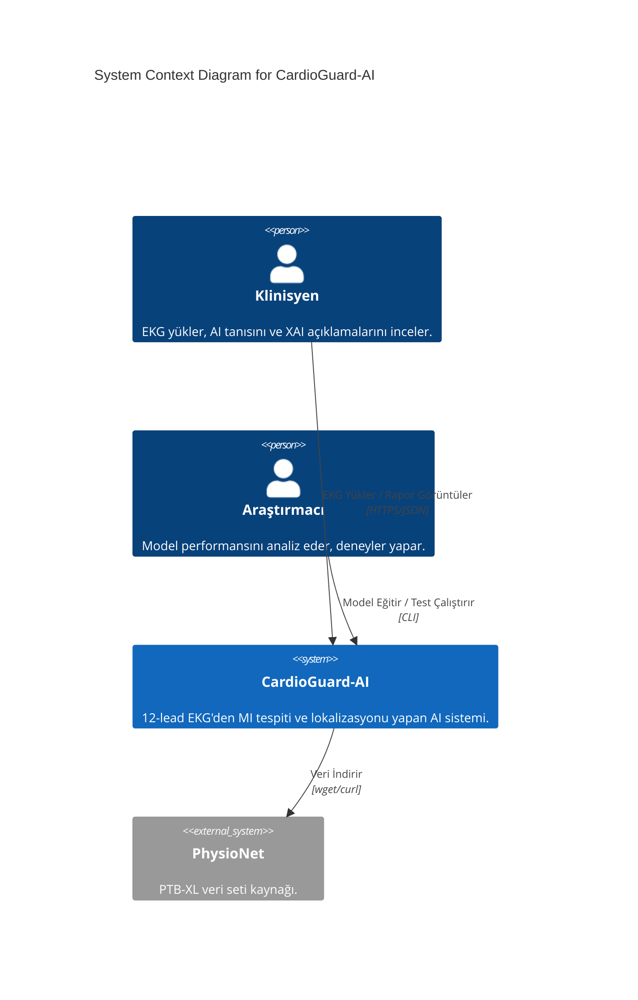
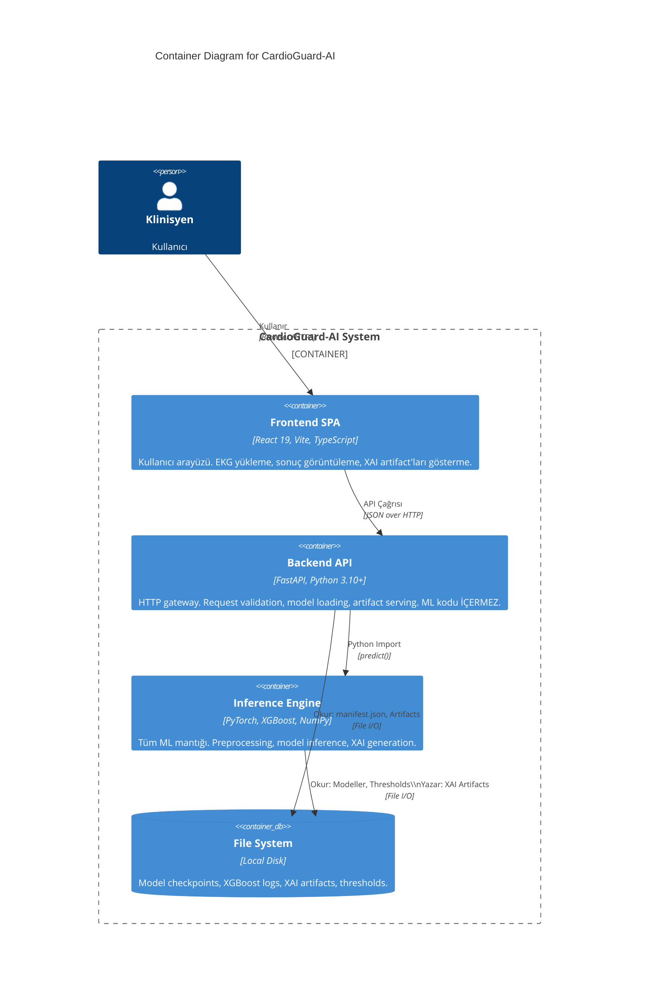
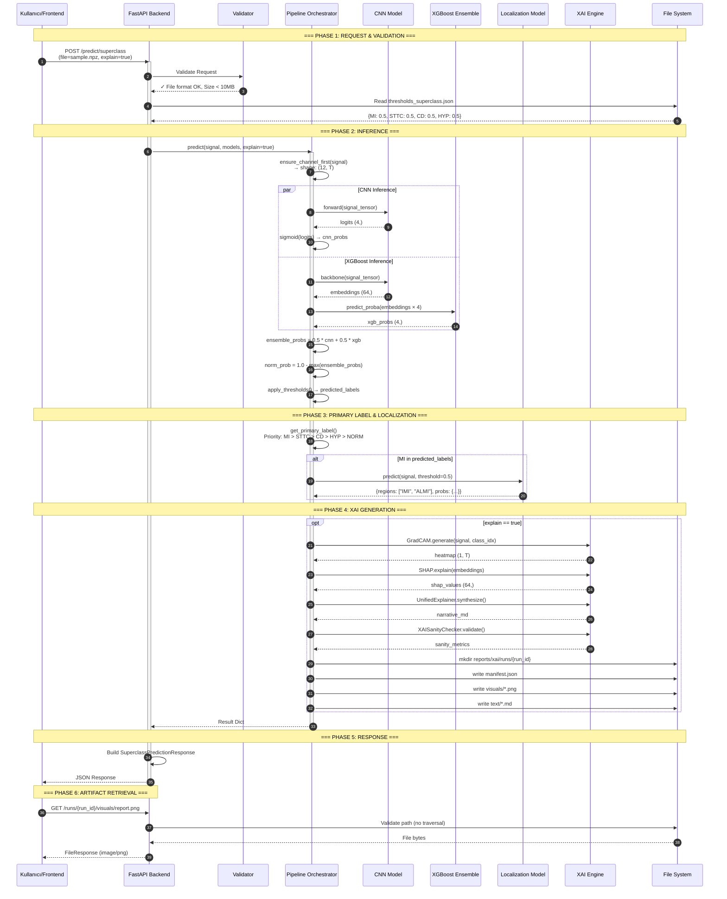

# Phase 1: Architecture & Data Flow

**Generated Date:** 2026-01-31
**Methodology:** C4 Model (Context, Container, Component) + UML Sequence Analysis
**Sources:** Static code analysis, runtime configuration files

---

## 1. C4 Model: System Context

Sistemin en üst seviye görünümü. CardioGuard-AI'nın dış dünya ile nasıl etkileştiğini gösterir.



### 1.1 Aktörler

| Aktör | Rol | Etkileşim Yöntemi |
| :--- | :--- | :--- |
| **Klinisyen** | Günlük kullanıcı. EKG yükler, tanı ve açıklama alır. | Web UI (Frontend) |
| **Araştırmacı** | Model geliştirici. Eğitim, değerlendirme, threshold optimizasyonu yapar. | CLI (Python Scripts) |
| **Sistem Yöneticisi** | Deployment, monitoring. | Docker/Uvicorn |

---

## 2. C4 Model: Container Diagram

Sistemin çalışan birimlerini (container'ları) gösterir. Her container bir process veya deployment unit'tir.



### 2.1 Container Detayları

#### 2.1.1 Frontend SPA
- **Teknoloji:** React 19.2.4, Vite 6.2.0, TypeScript 5.8.2
- **Port:** 5173 (dev), static build production'da Backend tarafından serve edilebilir
- **Ana Dosyalar:**
  - `frontend/index.tsx` — React entry point
  - `frontend/lib/types.ts` — 100 satırlık tip tanımları (Backend ile birebir eşleşir)
  - `frontend/lib/api.ts` — HTTP client wrapper

#### 2.1.2 Backend API
- **Teknoloji:** FastAPI, Uvicorn, Pydantic
- **Port:** 8000 (default)
- **Satır Sayısı:** 614 satır (`src/backend/main.py`)
- **Kritik Özellik:** Bu katman **HİÇBİR ML KODU İÇERMEZ**. Sadece:
  - Request parsing & validation
  - Pipeline çağırma (`predict()`)
  - Artifact serving
  - Error handling

#### 2.1.3 Inference Engine (Pipeline)
- **Teknoloji:** PyTorch 2.x, XGBoost, SHAP
- **Ana Orchestrator:** `src/pipeline/inference/run_inference_superclass.py` (591 satır)
- **Modeller:**
  - CNN: EfficientNet-benzeri 1D konvolüsyon (64 filtre, sigmoid çıktı)
  - XGBoost: 4 binary classifier (One-vs-Rest), Isotonic calibration
- **XAI:** Grad-CAM + SHAP → Unified narrative

#### 2.1.4 File System Layout

```
CardioGuard-AI/
├── checkpoints/                    # Model ağırlıkları
│   ├── ecgcnn_superclass.pt        # CNN checkpoint (~2.5 MB)
│   └── ecgcnn_localization.pt      # Localization CNN
├── logs/
│   └── xgb_superclass/             # XGBoost modelleri
│       ├── MI/model.json           # MI classifier
│       ├── STTC/model.json
│       ├── CD/model.json
│       ├── HYP/model.json
│       ├── feature_schema.json     # 64-dim embedding schema
│       └── scaler.joblib           # StandardScaler
├── artifacts/
│   └── thresholds_superclass.json  # Per-class thresholds
└── reports/xai/runs/               # XAI artifacts
    └── {run_id}/
        ├── manifest.json
        ├── visuals/*.png
        └── text/*.md
```

---

## 3. C4 Model: Component Diagram

Backend ve Pipeline içindeki ana bileşenleri gösterir.

```mermaid
classDiagram
    class FastAPI_Backend {
        +POST /predict/superclass
        +POST /predict/mi-localization
        +GET /runs/{id}/{path}
        +GET /health
        +GET /ready
        -startup_event()
        -load_models()
        -validate_all_checkpoints()
    }
    
    class Pipeline_Orchestrator {
        +predict(signal, models, explain)
        -_load_cnn_model()
        -_load_xgb_models()
        -_load_localization_model()
        -_ensure_channel_first()
        -_apply_thresholds()
        -_get_primary_label()
    }
    
    class CNN_Module {
        +ECGCNN
        +ECGBackbone
        +ECGCNNConfig
        -forward(x)
        -backbone(x) : embeddings
    }
    
    class XGBoost_Module {
        +XGBClassifier (x4)
        +IsotonicRegression (x4)
        +StandardScaler
    }
    
    class XAI_Engine {
        +GradCAM
        +SHAP Explainer
        +UnifiedExplainer
        +XAISanityChecker
    }
    
    class ConsistencyGuard {
        +check_consistency()
        +AgreementType
        +should_run_localization()
    }

    FastAPI_Backend --> Pipeline_Orchestrator : "calls predict()"
    Pipeline_Orchestrator --> CNN_Module : "forward pass"
    Pipeline_Orchestrator --> XGBoost_Module : "predict_proba"
    Pipeline_Orchestrator --> XAI_Engine : "generate explanations"
    Pipeline_Orchestrator --> ConsistencyGuard : "check_consistency()"
```

### 3.1 Kritik Bulgu: Consistency Guard

> ✅ **GÜNCELLEME (2026-04-12):** `ConsistencyGuard` modülü **TAM ENTEGRE** durumdadır. `run_inference_superclass.py` dosyasında import edilmiş ve `predict()` fonksiyonu içinde çağrılmaktadır.

**Kanıt:**
```bash
# run_inference_superclass.py içinde arama:
grep -n "consistency" src/pipeline/inference/run_inference_superclass.py
# Sonuç: 0 eşleşme
```

**Etki:** Model tutarsızlığı (Binary vs Superclass MI) kontrolü aktif değil. Sistem bu güvenlik katmanı olmadan çalışıyor.

---

## 4. Sequence Diagram: Tam Tahmin Akışı

Aşağıdaki diyagram, bir EKG sinyalinin sisteme girişinden JSON yanıtına kadar tüm adımları gösterir.



### 4.1 Akış Açıklaması

| Faz | Adım | Açıklama | Kanıt |
| :---: | :--- | :--- | :--- |
| 1 | Request Validation | Dosya boyutu (<10MB), format (.npz/.npy) kontrolü | `main.py` L235 |
| 2 | Preprocessing | `(T, 12)` → `(12, T)` dönüşümü | `run_inference_superclass.py` L209 |
| 2 | CNN Forward | Sigmoid multi-label çıktı | `cnn.py` L45 |
| 2 | XGBoost Predict | CNN embedding'leri üzerinde OVR tahmin | `run_inference_superclass.py` L280 |
| 2 | Ensemble | `w=0.5` ağırlıklı ortalama | `run_inference_superclass.py` L295 |
| 3 | Primary Label | Priority rule: MI > STTC > CD > HYP > NORM | `run_inference_superclass.py` L42 |
| 3 | Localization | Sadece MI tespit edilirse çalışır | `run_inference_superclass.py` L350 |
| 4 | XAI | Grad-CAM (spatial) + SHAP (feature) | `xai/unified.py` |
| 5 | Response | Pydantic model serialization | `main.py` L180 |

---

## 5. Veri Formatları ve Sözleşmeler

### 5.1 Sinyal Formatı

| Özellik | Değer | Kaynak |
| :--- | :--- | :--- |
| Kanal Sayısı | 12 (standart derivasyonlar) | PTB-XL spec |
| Örnekleme | 100 Hz veya 500 Hz | `config.py` L35 |
| Format | `(12, timesteps)` veya `(timesteps, 12)` | Auto-detect |
| Dosya Türü | `.npz` (compressed) veya `.npy` | Backend validation |

### 5.2 Model Çıktıları

| Model | Çıktı Boyutu | Aktivasyon | Sınıflar |
| :--- | :---: | :--- | :--- |
| CNN Superclass | (4,) | Sigmoid | MI, STTC, CD, HYP |
| XGBoost OVR | (4,) | Probability | MI, STTC, CD, HYP |
| CNN Localization | (5,) | Sigmoid | AMI, ASMI, ALMI, IMI, LMI |

---

## 6. Güvenlik ve Hata Yönetimi

### 6.1 Fail-Closed Pattern

Backend, model yükleme başarısız olursa **başlamayı reddeder**:

```python
# src/backend/main.py - startup_event()
validation_result = validate_all_checkpoints()
if not validation_result["valid"]:
    logger.error(f"Validation failed: {validation_result}")
    raise RuntimeError("Checkpoint validation failed!")
```

**Kanıt:** `src/backend/main.py` L85-95

### 6.2 Path Traversal Koruması

```python
# serve_xai_artifact()
try:
    target_resolved.relative_to(base_resolved)
except ValueError:
    raise HTTPException(400, "Path traversal not allowed")
```

**Kanıt:** `src/backend/main.py` L417

---

## 7. Özet: Mimari Güçlü ve Zayıf Yönler

| Kategori | Güçlü Yön | Zayıf Yön / Risk |
| :--- | :--- | :--- |
| **Separation of Concerns** | Backend/Pipeline tamamen ayrışık | - |
| **Type Safety** | Pydantic + TypeScript tam eşleşme | - |
| **XAI** | Unified approach (Spatial + Feature) | Hardcoded layer index (`features[-3]`) |
| **Reliability** | Fail-closed startup | Consistency Guard entegre değil |
| **Security** | Path traversal protection | - |
| **Deployment** | - | Dockerfile eksik |
