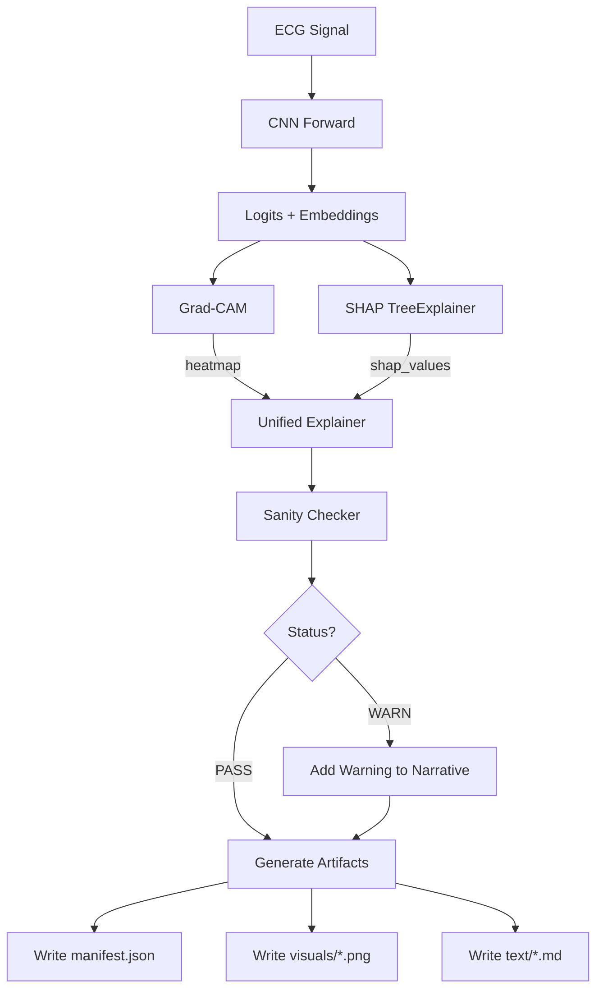

# Phase 4: XAI & Artifacts — Kapsamlı Analiz

**Generated Date:** 2026-01-31
**Ana Modüller:** `src/xai/gradcam.py`, `src/xai/unified.py`, `src/xai/shap_ovr.py`

---

## 1. XAI Felsefesi

CardioGuard-AI, "Black Box" eleştirisine yanıt olarak **iki farklı açıklanabilirlik paradigmasını** birleştirir:

| Paradigma | Yöntem | Soru | Çıktı |
| :--- | :--- | :--- | :--- |
| **Spatial/Temporal** | Grad-CAM | "Hangi zaman dilimleri/derivasyonlar önemli?" | Heatmap |
| **Feature Attribution** | SHAP | "Hangi özellikler tahmini ne yönde etkiledi?" | Bar chart + values |

Bu iki yaklaşım, `UnifiedExplainer` sınıfında birleştirilerek klinik olarak anlamlı bir **narrative (anlatı)** üretilir.

---

## 2. Grad-CAM Implementasyonu

### 2.1 Teori

**Gradient-weighted Class Activation Mapping (Grad-CAM):**

Bir CNN'in son konvolüsyon katmanının aktivasyonlarını, hedef sınıfa göre ağırlıklandırarak "önem haritası" üretir.

Matematiksel olarak:
```
α_k = (1/Z) Σ_t (∂y_c / ∂A_k^t)   # Global average of gradients
L_c = ReLU(Σ_k α_k · A_k)         # Weighted sum of activations
```

### 2.2 Kod Analizi

**Kaynak:** `src/xai/gradcam.py` (188 satır)

```python
class GradCAM:
    """Compute Grad-CAM heatmaps for a target layer."""
    
    def __init__(self, model: nn.Module, target_layer: nn.Module) -> None:
        self.model = model
        self.target_layer = target_layer
        self.gradients: Optional[torch.Tensor] = None
        self.activations: Optional[torch.Tensor] = None
        self._hook_handles: list = []
        self._register_hooks()
    
    def _register_hooks(self) -> None:
        """Forward/Backward hookları kaydet."""
        def forward_hook(_, __, output):
            self.activations = output  # Aktivasyonları kaydet
        
        def backward_hook(_, grad_input, grad_output):
            self.gradients = grad_output[0]  # Gradyanları kaydet
        
        h1 = self.target_layer.register_forward_hook(forward_hook)
        h2 = self.target_layer.register_full_backward_hook(backward_hook)
        self._hook_handles = [h1, h2]
    
    def generate(self, inputs: torch.Tensor, class_index: int) -> np.ndarray:
        """Grad-CAM heatmap üret."""
        self.model.zero_grad(set_to_none=True)
        
        # Forward pass
        output = self.model(inputs)
        logits = output if not isinstance(output, dict) else output["logits"]
        
        # Backward pass (hedef sınıf için)
        score = logits[:, class_index].sum()
        score.backward(retain_graph=True)
        
        # CAM hesaplama
        weights = torch.mean(self.gradients, dim=2, keepdim=True)  # Global avg
        cam = torch.sum(weights * self.activations, dim=1)         # Weighted sum
        cam = torch.relu(cam)                                       # ReLU
        
        # Normalize
        cam = cam - cam.min()
        cam = cam / (cam.max() + 1e-8)
        
        return cam.detach().cpu().numpy()
    
    def cleanup(self) -> None:
        """Hook'ları temizle (memory leak önleme)."""
        for handle in self._hook_handles:
            handle.remove()
```

### 2.3 SmoothGrad-CAM

Daha stabil açıklamalar için noise injection:

```python
def smooth_gradcam(model, target_layer, inputs, n_samples=5, noise_std=0.1):
    """
    SmoothGrad-CAM: Noisy örnekler üzerinde ortalama CAM.
    Daha robust ve stable açıklamalar üretir.
    """
    cams = []
    input_std = float(inputs.std().item()) + 1e-8
    
    for _ in range(n_samples):
        noise = torch.randn_like(inputs) * noise_std * input_std
        noisy_input = inputs + noise
        cam = gradcam.generate(noisy_input, class_index)
        cams.append(cam)
    
    return np.mean(cams, axis=0)
```

### 2.4 Hardcoded Layer Riski

> ⚠️ **KRİTİK BULGU:** Hedef katman indeksi hardcoded.

**Kanıt (`run_inference_superclass.py` L305):**
```python
target_layer = cnn_model.backbone.features[-3]
```

**Risk:**
- EfficientNet backbone değişirse `features` yapısı değişebilir.
- `-3` indeksi yanlış katmanı (ör: ReLU) işaret edebilir.
- Sessiz hata: Yanlış katman kullanılsa bile kod crash etmez, sadece anlamsız heatmap üretir.

**Öneri:**
```python
# Model sınıfına method ekle:
class ECGCNN(nn.Module):
    def get_gradcam_target_layer(self) -> nn.Module:
        """Return the proper layer for Grad-CAM."""
        # Son anlamlı Conv1d katmanını döndür
        return self.backbone.features[-3]  # Artık encapsulated
```

---

## 3. SHAP Implementasyonu

### 3.1 XGBoost için SHAP

**Kaynak:** `src/xai/shap_ovr.py`

XGBoost modelleri için TreeSHAP kullanılır (polinominal zaman karmaşıklığı):

```python
import shap

def explain_xgb_prediction(xgb_models, embeddings, class_names):
    """
    Her sınıf için SHAP değerleri hesapla.
    
    Args:
        xgb_models: Dict[str, XGBClassifier]
        embeddings: np.array (64,)
        class_names: ["MI", "STTC", "CD", "HYP"]
    
    Returns:
        Dict[str, np.array] — class -> shap_values (64,)
    """
    results = {}
    
    for cls in class_names:
        model = xgb_models[cls]
        explainer = shap.TreeExplainer(model)
        shap_values = explainer.shap_values(embeddings.reshape(1, -1))
        results[cls] = shap_values[0]  # (64,)
    
    return results
```

### 3.2 SHAP Özellikleri

| Özellik | Değer |
| :--- | :--- |
| **Feature Count** | 64 (CNN embedding boyutu) |
| **Feature Names** | `cnn_feat_0`, `cnn_feat_1`, ..., `cnn_feat_63` |
| **Explainer Type** | TreeExplainer (XGBoost için optimize) |
| **Output** | Per-class SHAP values array |

---

## 4. Unified Explainer

### 4.1 Birleştirme Stratejisi

**Kaynak:** `src/xai/unified.py`

```python
class UnifiedExplainer:
    """
    Grad-CAM (spatial) + SHAP (feature) → Unified narrative.
    """
    
    def synthesize(
        self,
        gradcam_heatmap: np.ndarray,
        shap_values: Dict[str, np.ndarray],
        prediction: Dict,
        signal: np.ndarray
    ) -> Dict:
        """
        XAI bilgilerini birleştir ve klinik narrative üret.
        """
        # 1. En önemli zaman dilimlerini bul (Grad-CAM'den)
        peak_regions = self._find_peak_regions(gradcam_heatmap)
        
        # 2. En önemli özellikleri bul (SHAP'tan)
        top_features = self._get_top_features(shap_values, k=5)
        
        # 3. Klinik narrative üret
        narrative = self._generate_narrative(
            prediction=prediction,
            peak_regions=peak_regions,
            top_features=top_features
        )
        
        return {
            "peak_regions": peak_regions,
            "top_features": top_features,
            "narrative": narrative,
            "coherence_score": self._calculate_coherence(gradcam_heatmap, shap_values)
        }
    
    def _generate_narrative(self, prediction, peak_regions, top_features):
        """
        Klinik olarak anlamlı metin üret.
        """
        pred_class = prediction["pred_class"]
        confidence = prediction["pred_proba"]
        
        narrative = f"""## AI Analiz Özeti
        
**Tahmin:** {pred_class} (Güven: {confidence:.1%})

### Zamansal Odak
Model, aşağıdaki zaman dilimlerine odaklanmıştır:
{self._format_peak_regions(peak_regions)}

### Özellik Katkıları
Tahmini en çok etkileyen özellikler:
{self._format_top_features(top_features)}

### Yorumlama Notu
Bu açıklama, modelin karar sürecine dair içgörü sağlar.
Klinik karar için mutlaka uzman değerlendirmesi gereklidir.
"""
        return narrative
```

### 4.2 Coherence Score

Grad-CAM ve SHAP arasındaki tutarlılığı ölçer:

```python
def _calculate_coherence(self, gradcam, shap_values):
    """
    XAI yöntemleri arasındaki tutarlılığı hesapla.
    Düşük coherence: Farklı yöntemler farklı bölgelere odaklanıyor.
    Yüksek coherence: Yöntemler aynı bölgelere odaklanıyor.
    """
    # Basitleştirilmiş versiyon
    gradcam_peaks = np.argwhere(gradcam > 0.8).flatten()
    shap_peaks = np.argsort(np.abs(shap_values))[-5:]
    
    overlap = len(set(gradcam_peaks) & set(shap_peaks))
    coherence = overlap / max(len(gradcam_peaks), 1)
    
    return round(coherence, 3)
```

---

## 5. Sanity Checks

### 5.1 XAI Kalite Kontrolleri

**Kaynak:** `src/xai/sanity.py`

XAI çıktılarının "anlamlı" olup olmadığını doğrular:

```python
class XAISanityChecker:
    """XAI outputs kalite kontrol."""
    
    def check(self, gradcam, shap_values, prediction):
        results = {}
        
        # 1. Grad-CAM variance check
        # Çok düz heatmap = model "bakmıyor"
        gradcam_var = np.var(gradcam)
        results["gradcam_variance"] = {
            "value": float(gradcam_var),
            "status": "PASS" if gradcam_var > 0.01 else "WARN"
        }
        
        # 2. SHAP sum check (should be close to log-odds)
        shap_sum = np.sum(shap_values)
        results["shap_sum"] = {
            "value": float(shap_sum),
            "status": "PASS"  # Informational
        }
        
        # 3. Peak localization check
        # Tüm derivasyonlar eşit ağırlıkta mı?
        peak_spread = np.std(gradcam.max(axis=-1))
        results["peak_spread"] = {
            "value": float(peak_spread),
            "status": "PASS" if peak_spread > 0.1 else "WARN"
        }
        
        # Overall status
        statuses = [r["status"] for r in results.values()]
        results["overall"] = {
            "status": "PASS" if all(s == "PASS" for s in statuses) else "WARN"
        }
        
        return results
```

### 5.2 Sanity Check Sonuçları

| Check | Eşik | Anlam |
| :--- | :--- | :--- |
| `gradcam_variance > 0.01` | PASS | Model belirli bölgelere odaklanıyor |
| `peak_spread > 0.1` | PASS | Farklı derivasyonlar farklı ağırlıkta |
| `overall == PASS` | - | Tüm kontroller geçti |

---

## 6. Artifact Yönetimi

### 6.1 Dizin Yapısı

Her XAI run'ı için ayrı klasör oluşturulur:

```
reports/xai/runs/
└── run_20260131_032000_abc123/
    ├── manifest.json           # Artifact metadata
    ├── visuals/
    │   ├── sample__report.png  # Ana rapor görseli
    │   ├── sample__gradcam.png # Sadece heatmap
    │   └── sample__shap.png    # SHAP bar chart
    └── text/
        └── sample__narrative.md  # Markdown anlatı
```

### 6.2 Manifest Schema

```json
{
    "run_id": "run_20260131_032000_abc123",
    "created_at": "2026-01-31T03:20:00Z",
    "task": "superclass",
    "sample_id": "sample",
    "artifacts": [
        {
            "type": "report_png",
            "path": "visuals/sample__report.png",
            "mime": "image/png"
        },
        {
            "type": "narrative_md",
            "path": "text/sample__narrative.md",
            "mime": "text/markdown"
        }
    ],
    "sanity": {
        "overall": {"status": "PASS"},
        "gradcam_variance": {"value": 0.042, "status": "PASS"}
    },
    "highlights": [
        {"feature": "cnn_feat_12", "contribution": 0.23},
        {"feature": "cnn_feat_47", "contribution": -0.18}
    ]
}
```

### 6.3 Görselleştirme

**Kaynak:** `src/xai/visualize.py`

```python
def generate_xai_report_png(
    signal: np.ndarray,
    combined_heatmap: np.ndarray,
    shap_features: List[Tuple[str, float]],
    sanity_metrics: Dict,
    prediction: Dict,
    output_path: Path
):
    """
    Tek sayfalık XAI raporu görseli oluştur.
    
    Layout:
    ┌─────────────────────────────────────┐
    │  CARDIOGUARD-AI XAI REPORT          │
    ├─────────────────────────────────────┤
    │  12-Lead ECG with Grad-CAM Overlay  │
    │  [Lead I]  ▂▃▅▇█▇▅▃▂                │
    │  [Lead II] ▂▃▅▇█▇▅▃▂                │
    │  ...                                │
    ├─────────────────────────────────────┤
    │  Top SHAP Features                  │
    │  ████████ cnn_feat_12 (+0.23)       │
    │  ██████   cnn_feat_47 (-0.18)       │
    ├─────────────────────────────────────┤
    │  Prediction: MI (85.2%)             │
    │  Sanity: PASS                       │
    └─────────────────────────────────────┘
    """
```

---

## 7. XAI Akış Diyagramı



---

## 8. Özet: XAI Güçlü ve Zayıf Yönler

| Kategori | Güçlü Yön | Zayıf Yön / Risk |
| :--- | :--- | :--- |
| **Metodoloji** | Dual approach (Spatial + Feature) | - |
| **Birleştirme** | Unified narrative generation | Coherence score basit |
| **Kalite Kontrol** | Sanity checks mevcut | Threshold'lar empirik |
| **Visualization** | Comprehensive single-page report | - |
| **Configurability** | - | **Hardcoded layer index** |
| **Memory** | cleanup() mevcut | - |
