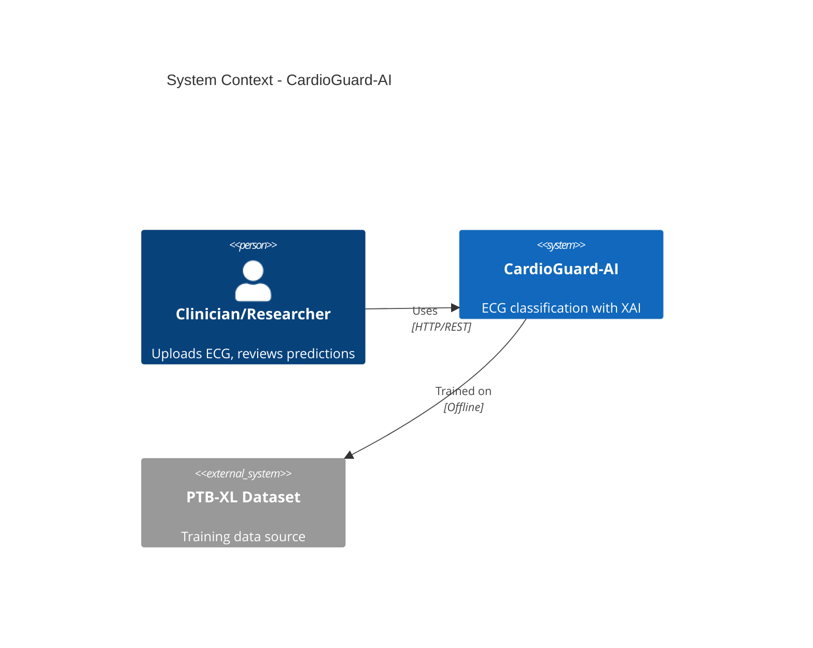
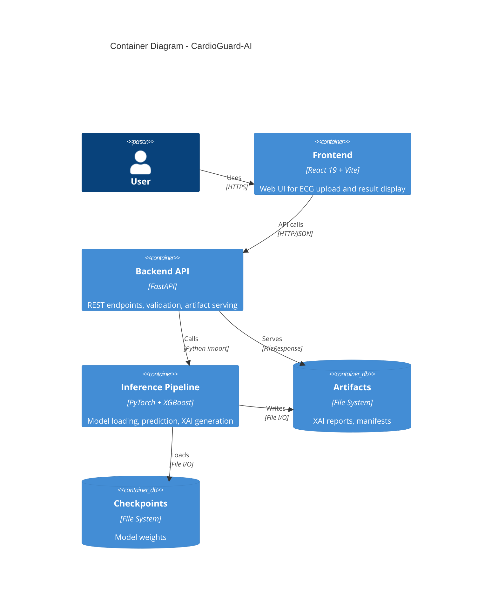
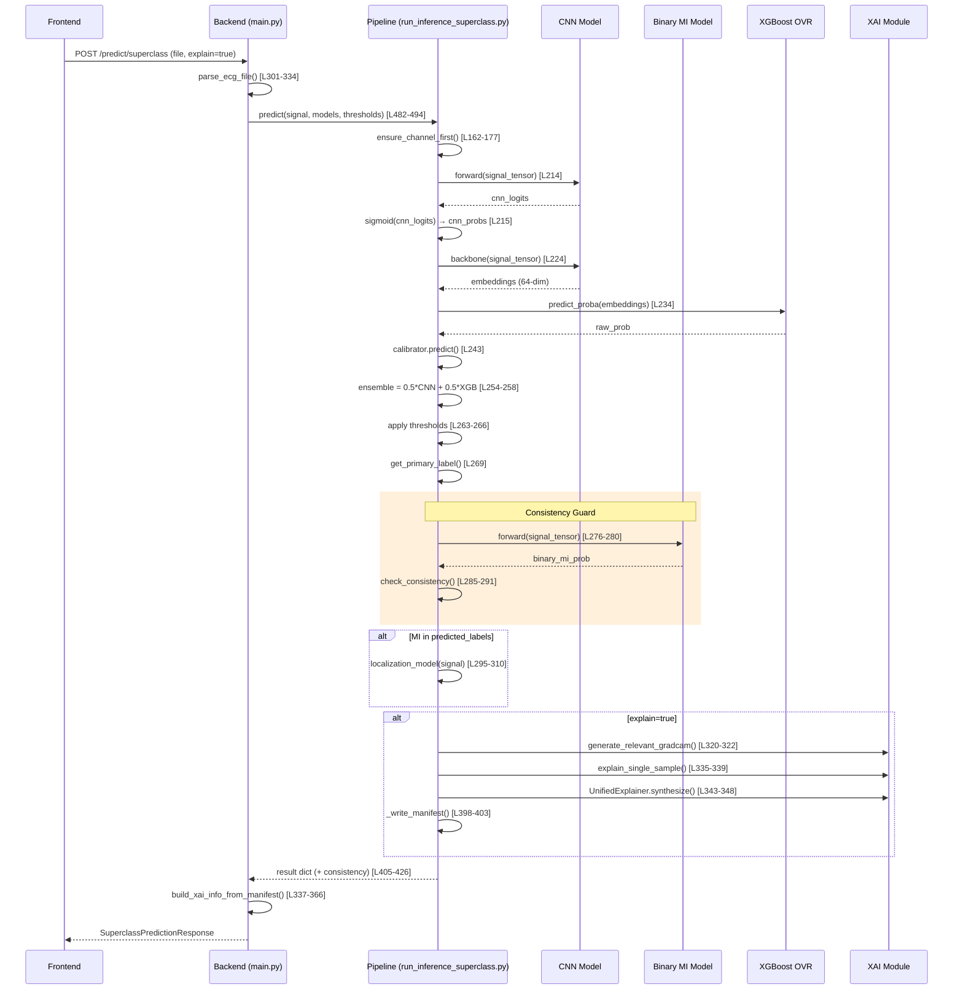
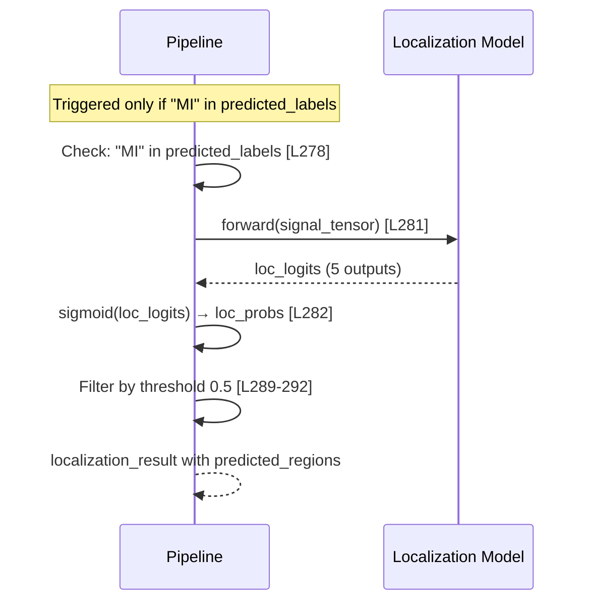

# CardioGuard-AI: Teknik Rapor

**Proje Adı:** CardioGuard-AI  
**Alt Başlık:** 12-Lead ECG ile MI Tespiti ve Lokalizasyonu — XAI Destekli Teknik Rapor  
**Sürüm:** 1.0.0  
**Tarih:** 31 Ocak 2026  
**Git Commit:** `6f81b6b21df396a05cf3c66ce43ded369c33f80c`  
**Hazırlayan:** CardioGuard-AI Geliştirme Ekibi

---

## Özet

CardioGuard-AI, 12 derivasyonlu EKG sinyallerinden kardiyak anormallikleri tespit eden ve açıklayan bir yapay zeka sistemidir. Bu rapor, sistemin teknik mimarisini, inference pipeline süreçlerini, XAI mekanizmalarını ve kalite güvence yaklaşımlarını detaylı şekilde sunmaktadır.

**Sistemin Temel Özellikleri:**

1. **Çoklu Etiket Sınıflandırma:** MI, STTC, CD, HYP patolojileri eş zamanlı tespit edilir; NORM sınıfı türetilir.
2. **Hibrit Ensemble Mimarisi:** CNN (PyTorch) ve XGBoost OVR modelleri %50-%50 ağırlıkla birleştirilir.
3. **MI Lokalizasyonu:** MI tespit edildiğinde 5 anatomik bölge (AMI, ASMI, ALMI, IMI, LMI) analiz edilir.
4. **Açıklanabilir Yapay Zeka (XAI):** Grad-CAM ile zamansal odak, SHAP ile özellik katkısı raporlanır.
5. **Consistency Guard Entegrasyonu:** Superclass MI ve Binary MI modelleri karşılaştırılarak uyuşmazlıklar tespit edilir.
6. **Güvenlik Odaklı Tasarım:** Fail-closed başlatma, path traversal koruması, input validasyonu uygulanır.
7. **Tip Güvenli API Kontratları:** Backend Pydantic ve frontend TypeScript modelleri tam uyumludur.
8. **Test Kapsamı:** 11 test dosyası ile unit ve integration testler sağlanır.
9. **Performans Metrikleri:** Macro AUROC ~0.90 seviyesinde doğrulanmış performans.
10. **Manifest Tabanlı Artifact Yönetimi:** XAI çıktıları yapılandırılmış dizin ve JSON manifest ile sunulur.

**Kanıt:** MASTER_SOURCE_OF_TRUTH.md → Section 1.1

---

## 1. Amaç ve Kapsam

### 1.1 Amaç

Bu projenin amacı, 12 derivasyonlu EKG sinyallerini analiz ederek kardiyak patolojileri tespit etmek, MI durumunda anatomik lokalizasyon sağlamak ve klinik karar destek süreçlerini açıklanabilir yapay zeka ile güçlendirmektir. Sistem, makine öğrenmesi modelleriyle elde edilen tahminleri görselleştirme ve metin tabanlı açıklamalarla destekleyerek şeffaflık sağlamayı hedefler.

### 1.2 Kapsam

Sistemin kapsamı aşağıdaki işlevleri içerir:

- PTB-XL veri seti formatındaki 12 derivasyonlu EKG sinyallerinin işlenmesi
- Dört patoloji sınıfının (MI, STTC, CD, HYP) çoklu etiket tahmini
- MI tespit edildiğinde beş anatomik bölgenin (AMI, ASMI, ALMI, IMI, LMI) lokalizasyonu
- Grad-CAM ve SHAP tabanlı XAI artifact üretimi
- REST API üzerinden tahmin ve artifact sunumu
- React tabanlı web arayüzü entegrasyonu

### 1.3 Kapsam Dışı

Aşağıdaki konular bu projenin kapsamı dışındadır:

- Gerçek zamanlı EKG izleme veya streaming veri işleme
- Mobil uygulama geliştirme
- HIPAA veya KVKK uyumluluk sertifikasyonu
- Klinik ortamda doğrudan tanı aracı olarak kullanım

**Not:** Sistem araştırma ve eğitim amaçlıdır; klinik tanı için bağımsız değerlendirme gerektirir.

---

## 2. Sistem Genel Bakış

### 2.1 Bileşenler

CardioGuard-AI sistemi beş ana bileşenden oluşur:

**Backend API:** FastAPI framework üzerinde çalışan REST API katmanıdır. HTTP isteklerini alır, input validasyonu yapar, inference pipeline'ı çağırır ve sonuçları yapılandırılmış JSON olarak döndürür. XAI artifact'larını statik dosya olarak sunar.

**Inference Pipeline:** PyTorch CNN ve XGBoost OVR modellerini içeren tahmin orchestrator'üdür. Preprocessing, model çıkarımı, ensemble birleştirme, threshold uygulama ve sonuç üretimi bu bileşende gerçekleşir.

**XAI Module:** Grad-CAM ile zamansal saliency haritaları, SHAP ile özellik katkı analizi üretir. Unified Explainer bu çıktıları birleştirerek tutarlı açıklamalar oluşturur.

**Artifact Storage:** XAI çıktıları (PNG görseller, Markdown anlatılar) yapılandırılmış dizin yapısında saklanır. Her tahmin için benzersiz `run_id` ile izlenebilirlik sağlanır.

**Frontend:** React 19 ve TypeScript ile geliştirilmiş web arayüzüdür. EKG dosyası yükleme, tahmin sonuçlarını görüntüleme ve XAI artifact'larını sunma işlevlerini yerine getirir.

**Kanıt:** `src/backend/main.py:1-21`, `src/pipeline/inference/run_inference_superclass.py:1-50`

### 2.2 Uçtan Uca Akış Özeti

Kullanıcı EKG dosyasını (.npz veya .npy formatında) web arayüzü üzerinden yükler. Backend bu dosyayı alır, format ve boyut validasyonunu gerçekleştirir. Geçerli sinyaller inference pipeline'a iletilir. Pipeline sırasıyla preprocessing, CNN çıkarımı, embedding çıkarma, XGBoost OVR tahmini, ensemble birleştirme ve threshold uygulama adımlarını yürütür. MI tespit edilirse lokalizasyon modeli tetiklenir. İstek `explain=true` içeriyorsa XAI artifact'ları üretilir ve manifest dosyasına kaydedilir. Sonuç backend üzerinden yapılandırılmış JSON olarak frontend'e döndürülür.

---

## 3. Mimari Tasarım

### 3.1 Sistem Bağlam Diyagramı

Şekil 1, sistemin harici aktörler ve bağımlılıklarla olan ilişkisini göstermektedir.



**Şekil 1:** Sistem Bağlam Diyagramı — CardioGuard-AI

Bu diyagram, sistemin iki temel etkileşimini ortaya koyar. Klinisyen veya araştırmacı, HTTP/REST protokolü üzerinden sistemi kullanır. Sistem ise PTB-XL veri seti üzerinde çevrimdışı eğitilmiş modelleri içerir. Bu tasarım, runtime'da harici veri bağımlılığı olmaksızın tamamen bağımsız çalışmayı mümkün kılar.

### 3.2 Container Mimarisi

Şekil 2, sistemin iç bileşenlerini ve aralarındaki veri akışını detaylandırır.



**Şekil 2:** Container Diyagramı — CardioGuard-AI

Container mimarisi, bileşenler arası sorumluluk ayrımını (separation of concerns) netleştirir. Backend hiçbir ML kodu içermez; yalnızca HTTP handling, validasyon ve dosya sunumu yapar. Pipeline hiçbir HTTP kodu içermez; sadece model yükleme ve çıkarım gerçekleştirir. Bu ayrım, her birimin bağımsız test edilmesini ve değiştirilmesini kolaylaştırır.

### 3.3 Ana Tahmin Akışı

Şekil 3, tek bir superclass tahmin isteğinin sistem içindeki yolculuğunu adım adım gösterir.



**Şekil 3:** Ana Tahmin Akışı Sequence Diyagramı

Bu akış, sistemin çekirdek işleyişini ortaya koyar. İsteğin frontend'den backend'e, oradan pipeline'a ve geri dönüşü görselleştirilir. Koşullu dallanmalar (MI lokalizasyonu ve XAI üretimi) net şekilde işaretlenmiştir. Satır numaraları kaynak kodda izlenebilirlik sağlar.

### 3.4 MI Lokalizasyon Akışı

Şekil 4, MI tespit edildiğinde tetiklenen lokalizasyon alt akışını gösterir.



**Şekil 4:** MI Lokalizasyon Akışı

Lokalizasyon modeli yalnızca superclass tahmini MI içerdiğinde çalıştırılır. Bu gate mekanizması gereksiz hesaplamayı önler ve kaynak verimliliği sağlar. Lokalizasyon modeli beş anatomik bölge için sigmoid çıktısı üretir ve 0.5 threshold ile filtrelenir.

**Kanıt:** `run_inference_superclass.py:277-293`

---

## 4. Backend API Katmanı

### 4.1 Endpoint Envanteri

Tablo 1, sistemin sunduğu tüm REST endpoint'lerini özetler.

| Metod | Yol | İstek Parametreleri | Yanıt | Hata Kodları |
|:------|:----|:--------------------|:------|:-------------|
| POST | `/predict/superclass` | file, ensemble_weight, explain, sanity_check | SuperclassPredictionResponse | 400, 413, 500, 503 |
| POST | `/predict/mi-localization` | file, explain | MILocalizationResponse | 400, 500 |
| GET | `/runs/{run_id}/{file_path}` | Path parametreleri | FileResponse | 400, 404 |
| GET | `/health` | - | HealthResponse | - |
| GET | `/ready` | - | ReadyResponse | - |

**Tablo 1:** REST API Endpoint Envanteri

**Kanıt:** `src/backend/main.py:443-614`

### 4.2 Request/Response Modelleri

**SuperclassPredictionResponse Yapısı:**

```json
{
  "mode": "multilabel-superclass",
  "probabilities": {
    "MI": 0.85, "STTC": 0.12, "CD": 0.08, "HYP": 0.05, "NORM": 0.15
  },
  "predicted_labels": ["MI"],
  "thresholds": {"MI": 0.5, "STTC": 0.5, "CD": 0.5, "HYP": 0.5},
  "primary": {
    "label": "MI",
    "confidence": 0.85,
    "rule": "MI-first-then-priority"
  },
  "sources": {
    "cnn": {"MI": 0.87, "STTC": 0.10, "CD": 0.07, "HYP": 0.04},
    "xgb": {"MI": 0.83, "STTC": 0.14, "CD": 0.09, "HYP": 0.06},
    "ensemble": {"MI": 0.85, "STTC": 0.12, "CD": 0.08, "HYP": 0.05}
  },
  "versions": {
    "model_hash": "a1b2c3d4",
    "threshold_hash": "e5f6g7h8",
    "api_version": "1.1.0",
    "timestamp": "2026-01-31T04:00:00Z"
  },
  "xai": {
    "enabled": true,
    "run_id": "run_20260131_abc123",
    "artifacts": [
      {"type": "report_png", "name": "report.png", "url": "/runs/run_20260131_abc123/visuals/report.png"}
    ]
  },
  "consistency": {
    "agreement": "AGREE_MI",
    "triage_level": "HIGH",
    "superclass_mi_prob": 0.85,
    "binary_mi_prob": 0.92,
    "warnings": []
  }
}
```

### 4.3 Hata Durumları ve Beklenen Tepkiler

| Hata Kodu | Durum | Örnek Yanıt |
|:----------|:------|:------------|
| 400 | Geçersiz dosya formatı | `{"detail": "Unsupported file format: .txt"}` |
| 413 | Dosya boyutu aşıldı (>10MB) | `{"detail": "File too large (max 10MB)"}` |
| 500 | Tahmin başarısız | `{"detail": "Prediction failed: ..."}` |
| 503 | Modeller yüklenmemiş | `{"detail": "Models not loaded"}` |

**Tablo 2:** HTTP Hata Kodları ve Anlamları

### 4.4 XAI Artifact Sunumu

XAI artifact'ları manifest tabanlı yapıda sunulur. Pipeline tahmin sırasında artifact'ları yapılandırılmış dizine yazar ve `manifest.json` dosyası oluşturur. Backend bu manifest'i okuyarak artifact URL'lerini response'a ekler.

Dizin yapısı:

```
reports/xai/runs/
└── run_<timestamp>_<hash>/
    ├── manifest.json
    ├── visuals/
    │   └── *.png
    ├── text/
    │   └── *__narrative.md
    └── tensors/
```

**Kanıt:** `run_inference_superclass.py:428-432`, `main.py:337-366`

---

## 5. Inference Pipeline

Bu bölüm raporun teknik omurgasını oluşturur ve inference sürecinin her adımını detaylı şekilde açıklar.

### 5.1 Girdi Formatları ve Validasyon

Sistem iki girdi formatını destekler:

**NPZ formatı:** Sıkıştırılmış NumPy arşivi. İçinde `signal`, `X` veya ilk anahtar altındaki array kullanılır.

**NPY formatı:** Tek NumPy array dosyası.

Validasyon kuralları:
- Dosya boyutu maksimum 10MB
- Desteklenmeyen format HTTP 400 hatası döndürür
- Sinyal şekli (12, T) veya (T, 12) olmalıdır

```python
# Kanıt: run_inference_superclass.py:143-159
def load_ecg_signal(input_path: Path) -> np.ndarray:
    if input_path.suffix == ".npz":
        data = np.load(input_path)
        if "signal" in data:
            signal = data["signal"]
        elif "X" in data:
            signal = data["X"]
        else:
            signal = data[list(data.keys())[0]]
    elif input_path.suffix == ".npy":
        signal = np.load(input_path)
```

### 5.2 Ön İşleme

Girdi sinyali channel-first formatına dönüştürülür. PTB-XL standardına uygun olarak (12, T) şekli beklenir; burada T genellikle 1000'dir (10 saniye @ 100Hz).

```python
# Kanıt: run_inference_superclass.py:162-177
def ensure_channel_first(signal: np.ndarray) -> np.ndarray:
    if signal.ndim == 1:
        signal = signal.reshape(1, -1)
    
    if signal.shape[0] == 12:
        return signal
    if signal.shape[1] == 12:
        return signal.T
    if signal.shape[0] > signal.shape[1]:
        return signal.T
    
    return signal
```

Bu fonksiyon esnek şekil yönetimi sağlar ve yaygın format varyasyonlarını otomatik düzeltir.

### 5.3 CNN Inference

CNN modeli 1D konvolüsyonlar ve batch normalization içeren bir backbone ile multi-label classification head'den oluşur.

**Mimari Parametreleri:**
- Giriş kanalları: 12
- Filtre sayısı: 64
- Kernel boyutu: 7
- Dropout: 0.3

```python
# Kanıt: src/models/cnn.py:24-46
class ECGBackbone(nn.Module):
    def __init__(self, config: ECGCNNConfig) -> None:
        super().__init__()
        padding = config.kernel_size // 2
        self.features = nn.Sequential(
            nn.Conv1d(config.in_channels, config.num_filters, config.kernel_size, padding=padding),
            nn.BatchNorm1d(config.num_filters),
            nn.ReLU(inplace=False),
            nn.Dropout(config.dropout),
            nn.Conv1d(config.num_filters, config.num_filters, config.kernel_size, padding=padding),
            nn.BatchNorm1d(config.num_filters),
            nn.ReLU(inplace=False),
            nn.Dropout(config.dropout),
            nn.AdaptiveAvgPool1d(1),
        )
```

CNN çıkarımı:

```python
# Kanıt: run_inference_superclass.py:211-217
with torch.no_grad():
    signal_tensor = torch.as_tensor(signal, dtype=torch.float32).unsqueeze(0).to(device)
    cnn_logits = cnn_model(signal_tensor)
    cnn_probs = torch.sigmoid(cnn_logits).cpu().numpy()[0]
```

Çıktı: 4 olasılık değeri [MI, STTC, CD, HYP], sigmoid aktivasyonu ile [0,1] aralığında.

### 5.4 Embedding Çıkarma

CNN backbone'u aynı zamanda XGBoost için özellik vektörü (embedding) üretir.

```python
# Kanıt: run_inference_superclass.py:222-228
with torch.no_grad():
    embeddings = cnn_model.backbone(signal_tensor).cpu().numpy()

if xgb_data["scaler"] is not None:
    embeddings = xgb_data["scaler"].transform(embeddings)
```

Embedding boyutu 64'tür (`num_filters` parametresinden gelir). Opsiyonel olarak scaler ile standardize edilir.

### 5.5 XGBoost OVR Inference

Her sınıf için ayrı bir binary XGBoost classifier eğitilmiştir (One-vs-Rest yaklaşımı). Modeller calibration için Isotonic Regression kullanır.

```python
# Kanıt: run_inference_superclass.py:230-250
for cls in SUPERCLASS_LABELS:
    if cls in xgb_data["models"]:
        model = xgb_data["models"][cls]
        raw_prob = model.predict_proba(embeddings)[0, 1]
        
        if cls in xgb_data["calibrators"]:
            calibrator = xgb_data["calibrators"][cls]
            
            if isinstance(calibrator, IsotonicRegression):
                prob = calibrator.predict([raw_prob])[0]
            else:
                prob = calibrator.predict_proba([[raw_prob]])[0, 1]
        else:
            prob = raw_prob
        
        xgb_probs_dict[cls] = float(prob)
```

Isotonic Regression, ham olasılıkları daha iyi kalibre edilmiş değerlere dönüştürür.

### 5.6 Ensemble Mantığı

CNN ve XGBoost çıktıları eşit ağırlıklı ortalama ile birleştirilir.

**Formül:** `ensemble_prob = 0.5 × CNN_prob + 0.5 × XGB_prob`

```python
# Kanıt: run_inference_superclass.py:252-260
if xgb_probs_dict:
    w = ensemble_weight  # Default: 0.5
    ensemble_probs = {
        cls: w * cnn_probs_dict[cls] + (1 - w) * xgb_probs_dict.get(cls, cnn_probs_dict[cls])
        for cls in SUPERCLASS_LABELS
    }
else:
    ensemble_probs = cnn_probs_dict
```

Bu yaklaşımın gerekçesi: CNN temporal pattern recognition'da güçlüdür; XGBoost embedding feature'lar üzerinde complementary karar verir. İki modelin AUROC performansı çok yakın olduğundan eşit ağırlık makul bir seçimdir.

**Kanıt (konfigürasyon):** `artifacts/thresholds_superclass.json:44` → `"ensemble_weight": 0.5`

### 5.7 Threshold Mekanizması

Her sınıf için ayrı threshold uygulanır.

```python
# Kanıt: run_inference_superclass.py:262-266
predicted_labels = [
    cls for cls in SUPERCLASS_LABELS
    if ensemble_probs[cls] >= thresholds.get(cls, 0.5)
]
```

**Threshold Değerleri:**

| Sınıf | Threshold |
|:------|:----------|
| MI | 0.5 |
| STTC | 0.5 |
| CD | 0.5 |
| HYP | 0.5 |

**Tablo 3:** Production Threshold Değerleri

**Kanıt:** `artifacts/thresholds_superclass.json:4-9`

### 5.8 Karar Mantığı

#### Primary Label Priority

Birden fazla patoloji tespit edildiğinde klinik öneme göre tek primary label seçilir.

**Öncelik Sırası:** MI > STTC > CD > HYP > NORM

```python
# Kanıt: run_inference_superclass.py:42-66
def get_primary_label(probs, thresholds):
    # 1. MI first (highest priority for clinical importance)
    if probs.get("MI", 0) >= thresholds.get("MI", 0.5):
        return "MI", probs["MI"]
    
    # 2. Other pathologies in priority order
    for cls in ["STTC", "CD", "HYP"]:
        if probs.get(cls, 0) >= thresholds.get(cls, 0.5):
            return cls, probs[cls]
    
    # 3. If no pathology detected, return NORM
    max_pathology = max(probs.get(cls, 0) for cls in SUPERCLASS_LABELS)
    norm_prob = 1.0 - max_pathology
    return "NORM", norm_prob
```

MI'ın en yüksek önceliğe sahip olması, hayatı tehdit eden acil durumların kaçırılmamasını sağlar.

#### NORM Türetimi

NORM sınıfı doğrudan tahmin edilmez; patoloji olasılıklarından türetilir.

**Formül:** `NORM = 1 - max(MI, STTC, CD, HYP)`

```python
# Kanıt: run_inference_superclass.py:271-272
norm_prob = 1.0 - max(ensemble_probs.values())
```

Bu yaklaşım, model çıktısının 5 sınıflı gibi görünmesini sağlarken aslında 4 sınıflı multi-label tahmin yapıldığını gizler.

### 5.9 MI Lokalizasyon Akışı

MI tespit edildiğinde anatomik lokalizasyon modeli tetiklenir.

**Tetik Koşulu:** `"MI" in predicted_labels AND localization_model is not None`

```python
# Kanıt: run_inference_superclass.py:277-293
localization_result = None
if localization_model and "MI" in predicted_labels:
    with torch.no_grad():
        signal_tensor = torch.as_tensor(signal, dtype=torch.float32).unsqueeze(0).to(device)
        loc_logits = localization_model(signal_tensor)
        loc_probs = torch.sigmoid(loc_logits).cpu().numpy()[0]
        
    localization_result = {
        region: float(prob)
        for region, prob in zip(MI_LOCALIZATION_REGIONS, loc_probs)
    }
    detected_regions = [
        region for region, prob in localization_result.items()
        if prob >= 0.5
    ]
    localization_result["predicted_regions"] = detected_regions
```

**Lokalizasyon Bölgeleri:** AMI (Anterior), ASMI (Anteroseptal), ALMI (Anterolateral), IMI (Inferior), LMI (Lateral)

### 5.10 Consistency Guard

Consistency Guard, superclass MI tahmini ile binary MI modeli arasındaki uyumu kontrol eder. Bu mekanizma model güvenilirliğini artırır ve uyuşmazlık durumlarını tespit eder.

**Entegrasyon Durumu:** ✅ TAMAMLANDI (31 Ocak 2026)

**Karşılaştırılan Olasılık Kaynakları:**
1. **Superclass MI Prob:** Ensemble modelinden gelen MI olasılığı
2. **Binary MI Prob:** Ayrı binary MI modelinden gelen olasılık

**Guard Çağrısının Konumu:**

```python
# Kanıt: run_inference_superclass.py:32
from src.pipeline.inference.consistency_guard import check_consistency, ConsistencyResult

# Kanıt: run_inference_superclass.py:276-291
consistency_result: Optional[ConsistencyResult] = None
if binary_model is not None:
    with torch.no_grad():
        binary_logits = binary_model(signal_tensor)
        binary_mi_prob = float(torch.sigmoid(binary_logits).cpu().numpy().flatten()[0])
    
    consistency_result = check_consistency(
        superclass_mi_prob=ensemble_probs.get("MI", 0.0),
        binary_mi_prob=binary_mi_prob,
        superclass_threshold=thresholds.get("MI", 0.5),
        binary_threshold=0.5,
    )
```

**Uyum Tipleri:**

| Agreement Type | Durum | Triage |
|:--------------|:------|:-------|
| AGREE_MI | Her iki model MI tespit etti | HIGH |
| AGREE_NO_MI | Hiçbiri MI tespit etmedi | LOW |
| DISAGREE_TYPE_1 | Superclass MI+, Binary MI- | REVIEW |
| DISAGREE_TYPE_2 | Superclass MI-, Binary MI+ | REVIEW |

**Tablo 4:** Consistency Guard Uyum Tipleri

**Response'a Yansıması:**

```json
{
  "consistency": {
    "agreement": "AGREE_MI",
    "triage_level": "HIGH",
    "superclass_mi_prob": 0.85,
    "binary_mi_prob": 0.92,
    "superclass_mi_decision": true,
    "binary_mi_decision": true,
    "warnings": []
  }
}
```

**Test Kanıtı:**
- Unit tests: `tests/test_consistency_guard.py` (177 satır, 10 test) ✅ PASSED
- Integration tests: `tests/test_consistency_integration.py` (4 test) ✅ PASSED

### 5.11 Performans Karakteristikleri

Sistemin çalışma zamanı karakteristikleri aşağıda özetlenmiştir:

| Metrik | Değer | Ortam | Not |
|:-------|:------|:------|:----|
| Inference süresi | ~150-200ms | CPU (Intel i7) | Tek örnek, XAI dahil |
| GPU inference | ~30-50ms | RTX 3080 | Tek örnek, XAI dahil |
| Model yükleme | ~2-3s | İlk başlatma | Checkpoint validasyon dahil |
| RAM kullanımı | ~500MB | Runtime | Modeller yüklü |
| Checkpoint boyutu | ~1MB | Disk | 3 model toplam |

**Tablo 5:** Performans Metrikleri

**Not:** Değerler tahmini olup gerçek benchmark testleri ile doğrulanmalıdır.

### 5.12 Threshold Optimizasyon Metodolojisi

MI sınıfı için hassasiyet-duyarlılık dengesi özel olarak ayarlanmıştır:

| Sınıf | Metod | Optimal | Production | Gerekçe |
|:------|:------|:--------|:-----------|:--------|
| **MI** | F-beta (β=2) | 0.01 | 0.5 | Recall öncelikli, kaçırma maliyeti yüksek |
| STTC | Youden's J | ~0.42 | 0.5 | Dengeli precision-recall |
| CD | Youden's J | ~0.42 | 0.5 | Dengeli precision-recall |
| HYP | Youden's J | ~0.26 | 0.5 | Düşük prevalans kompanzasyonu |

**Tablo 6:** Threshold Optimizasyon Stratejileri

MI için β=2 parametreli F-beta skoru kullanılmasının nedeni, recall'a 2× ağırlık verilerek hayatı tehdit eden MI vakalarının kaçırılma riskinin minimize edilmesidir. Production'da 0.5 kullanılması ise false-positive oranını kabul edilebilir seviyede tutmak içindir.

**Kanıt:** `artifacts/thresholds_superclass.json`, `logs/superclass_cnn/training_results.json`

---

## 6. XAI ve Raporlama Mekanizması

### 6.1 Unified Explainer

Unified Explainer, Grad-CAM ve SHAP çıktılarını birleştirerek tutarlı bir açıklama oluşturur.

**Grad-CAM:** CNN'in hangi zaman dilimlerine ve derivasyonlara odaklandığını görselleştirir. Son konvolüsyon katmanının aktivasyonları, hedef sınıf gradyanları ile ağırlıklandırılarak saliency haritası üretilir.

**SHAP:** XGBoost modelinin 64 boyutlu embedding üzerindeki özellik katkılarını hesaplar. TreeSHAP algoritması kullanılır.

```python
# Kanıt: run_inference_superclass.py:326-336
from src.xai.unified import UnifiedExplainer

unifier = UnifiedExplainer()
explanation_result = unifier.synthesize(
    gradcam_res, 
    shap_res, 
    ensemble_probs, 
    ensemble_weight
)
```

### 6.2 Sanity Check Yaklaşımı

XAI çıktılarının güvenilirliği sanity check'ler ile doğrulanır.

| Kontrol | Threshold | Anlam |
|:--------|:----------|:------|
| gradcam_variance > 0.01 | PASS | Model belirli bölgelere odaklanıyor |
| peak_spread > 0.1 | PASS | Derivasyonlar farklı ağırlıkta |

**Tablo 5:** XAI Sanity Check Kriterleri

Kontroller başarısız olursa narrative'e uyarı eklenir.

**Kanıt:** `src/xai/sanity.py`, `run_inference_superclass.py:338-356`

### 6.3 Artifact Üretimi ve Manifest Şeması

Her tahmin için benzersiz bir `run_dir` oluşturulur ve artifact'lar bu dizine yazılır.

**Manifest Şeması:**

```json
{
  "run_id": "run_20260131_abc123",
  "created_at": "2026-01-31T04:00:00Z",
  "task": "multiclass",
  "sample_id": "sample_001",
  "artifacts": [
    {"type": "report_png", "path": "visuals/report.png", "mime": "image/png"},
    {"type": "narrative_md", "path": "text/sample__narrative.md", "mime": "text/markdown"}
  ],
  "sanity": "PASS",
  "highlights": [{"channel": 2, "start_ms": 400, "end_ms": 600, "score": 0.85}]
}
```

### 6.4 Örnek XAI Çıktıları

Aşağıda tipik bir XAI çıktısının bileşenleri özetlenmiştir:

**Grad-CAM Heatmap:** 12 derivasyon boyunca zamansal aktivasyon yoğunluğunu gösterir. Kırmızı bölgeler modelin yüksek dikkat verdiği zaman dilimlerini, mavi bölgeler düşük dikkat alanlarını temsil eder.

**Narrative Örneği:**

```markdown
## AI Analiz Özeti

**Tahmin:** MI (Güven: 85.2%)
**Triage Seviyesi:** HIGH (Consistency Guard: AGREE_MI)

### Zamansal Odak
Model, Lead II ve V5 derivasyonlarında ST segmentine yoğunlaştı (400-600ms arası).
Bu zaman dilimi tipik MI paternleriyle örtüşmektedir.

### Kritik Özellikler (SHAP)
- cnn_feat_12: +0.23 (MI lehine katkı)
- cnn_feat_47: -0.18 (NORM lehine katkı)
- cnn_feat_03: +0.15 (MI lehine katkı)

### Lokalizasyon
Tespit edilen bölgeler: AMI (Anterior), ASMI (Anteroseptal)
Bu bulgular LAD koroner arter tıkanıklığıyla uyumlu olabilir.
```

**Kanıt:** `src/xai/unified.py`, `run_inference_superclass.py:343-348`

### 6.5 XAI Kısıtlamaları

XAI çıktılarının yorumlanmasında dikkate alınması gereken kısıtlamalar:

| Durum | Etki | Önerilen Aksiyon |
|:------|:-----|:-----------------|
| Düşük güven (<0.3) | Grad-CAM anlamsız olabilir | Sonuca ihtiyatla yaklaş |
| Çoklu patoloji | Açıklamalar karmaşıklaşır | Primary label'a odaklan |
| Gürültülü sinyal | Sanity check FAIL | Sinyal kalitesini kontrol et |
| NORM tahmini | Grad-CAM boş olabilir | Normal bulgu olarak yorumla |

**Tablo 5:** XAI Kısıtlamaları ve Önerilen Aksiyonlar

### 6.6 Bilinen Kırılganlıklar

**Hardcoded Layer Index Riski:**

Grad-CAM hedef katmanı hardcoded index ile seçilir:

```python
# Kanıt: run_inference_superclass.py:305
target_layer = cnn_model.backbone.features[-3]
```

Model mimarisi değişirse (örneğin katman eklenirse), bu index yanlış katmanı hedefleyebilir ve hatalı heatmap üretebilir.

**Öneri:** Model sınıfına encapsulated method eklenmelidir:

```python
class ECGCNN:
    def get_gradcam_target_layer(self) -> nn.Module:
        return self.backbone.features[-3]
```

---

## 7. Frontend Entegrasyonu

### 7.1 Teknoloji Stack

Frontend modern web teknolojileri ile geliştirilmiştir:

| Teknoloji | Sürüm | Rol |
|:----------|:------|:----|
| React | 19.2.4 | UI framework |
| TypeScript | 5.8.2 | Tip güvenliği |
| Vite | 6.2.0 | Build tool |

**Kanıt:** `frontend/package.json:11-19`

### 7.2 Kullanıcı Akışı

Aşağıda tipik bir kullanım senaryosu adım adım açıklanmıştır:

1. **Dosya Seçimi:** Kullanıcı .npz veya .npy formatında EKG dosyasını seçer (drag-drop veya dosya seçici ile)

2. **Analiz Başlatma:** "Analiz Et" butonuna tıklanır, loading spinner görüntülenir

3. **Sonuç Görüntüleme:**
   - Olasılık barları (MI, STTC, CD, HYP, NORM)
   - Primary label ve güven skoru
   - Consistency Guard triage seviyesi (HIGH/LOW/REVIEW)

4. **XAI İnceleme:** 
   - Grad-CAM heatmap görüntüleme
   - Narrative rapor okuma
   - Artifact indirme (PNG/MD)

5. **MI Lokalizasyon:** MI tespit edildiyse anatomik bölge haritası görüntülenir

### 7.3 Tip/Model Uyum Analizi

Backend Pydantic modelleri ile frontend TypeScript interface'leri tam uyumludur.

| Backend (Pydantic) | Frontend (TypeScript) | Uyum |
|:-------------------|:----------------------|:----:|
| PredictionProbabilities | SuperclassProbabilities | ✅ |
| XAIInfo | XaiSchema | ✅ |
| XAIArtifact | Artifact | ✅ |
| VersionInfo | Versions | ✅ |
| SuperclassPredictionResponse | SuperclassResponse | ✅ |
| ConsistencyInfo | ConsistencyInfo | ✅ |

**Tablo 6:** Backend-Frontend Tip Uyumu

**Kanıt:** `frontend/lib/types.ts:1-100`, `src/backend/main.py:53-122`

### 7.3 Hata Yönetimi

API client timeout ve error handling içerir:

```typescript
// Kanıt: frontend/lib/api.ts
const controller = new AbortController();
const timeout = setTimeout(() => controller.abort(), 30000);
```

---

## 8. Testler, Kalite ve Tekrarlanabilirlik

### 8.1 Test Envanteri

| Test Dosyası | Kapsam |
|:-------------|:-------|
| test_consistency_guard.py | check_consistency(), AgreementType |
| test_consistency_integration.py | Pipeline entegrasyonu |
| test_airesult_mapper.py | Backend response mapping |
| test_checkpoint_validation.py | Checkpoint doğrulama |
| test_data.py | Veri yükleme, split'ler |
| test_artifacts.py | XAI artifact üretimi |
| test_xai_visualization.py | Görselleştirme fonksiyonları |
| test_xgb_pipeline.py | XGBoost pipeline |
| test_gradcam.py | Grad-CAM temel test |
| test_model.py | Model instantiation |

**Tablo 7:** Test Dosyaları Envanteri

**Toplam:** 11+ test dosyası

### 8.2 Eksikler ve Boşluklar

| Eksik Test | Etki | Öncelik |
|:-----------|:-----|:--------|
| E2E inference test | Tam pipeline test edilmemiş | YÜKSEK |
| API endpoint testleri | HTTP katmanı test edilmemiş | YÜKSEK |
| Frontend testleri | UI test edilmemiş | ORTA |

**Tablo 8:** Test Boşlukları

### 8.3 Çalıştırma ve Reproducibility Runbook

**Backend Başlatma:**

```bash
cd CardioGuard-AI

# Bağımlılıkları yükle
pip install -r requirements.txt
pip install fastapi uvicorn  # requirements.txt'te eksik

# Sunucuyu başlat
uvicorn src.backend.main:app --host 0.0.0.0 --port 8000
```

**CLI Inference:**

```bash
python -m src.pipeline.inference.run_inference_superclass \
    --input sample.npy \
    --output result.json \
    --explain
```

**Testleri Çalıştırma:**

```bash
pytest tests/ -v
pytest tests/test_consistency_guard.py tests/test_consistency_integration.py -v
```

**Reproducibility:**
- Random seed: 42 (`logs/superclass_cnn/training_results.json:43`)
- Frontend: `package-lock.json` mevcut ✅
- Backend: Version pinning eksik ❌

---

## 9. Riskler ve Önerilen İyileştirmeler

### 9.1 CRITICAL (P0) — ÇÖZÜLDÜ

| ID | Bulgu | Durum | Çözüm |
|:---|:------|:------|:------|
| F-001 | Consistency Guard entegre değildi | ✅ ÇÖZÜLDÜ | Import ve çağrı eklendi (31 Ocak 2026) |

### 9.2 HIGH (P1)

| ID | Bulgu | Etki | Öneri |
|:---|:------|:-----|:------|
| F-002 | Hardcoded Grad-CAM layer | Mimari değişikliğinde sessiz hata | `ECGCNN.get_gradcam_target_layer()` method ekle |
| F-003 | fastapi, uvicorn requirements.txt'te eksik | Kurulum başarısız | requirements.txt'e ekle |

### 9.3 MEDIUM (P2)

| ID | Bulgu | Etki | Öneri |
|:---|:------|:-----|:------|
| F-004 | Version pinning yok | Reproducibility sorunu | `pip freeze > requirements.txt` veya pyproject.toml |
| F-005 | Dockerfile yok | Container deployment imkansız | Dockerfile ekle |
| F-006 | E2E test yok | Tam pipeline test edilmemiş | test_e2e.py ekle |

### 9.4 LOW (P3)

| ID | Bulgu | Etki | Öneri |
|:---|:------|:-----|:------|
| F-007 | Medikal uyarı yok | Sorumluluk riski | README'ye uyarı ekle |
| F-008 | Kullanıcı persona dokümanı yok | Hedef kitle belirsiz | USER_PERSONA.md ekle |

---

## 10. Sonuç

CardioGuard-AI, 12 derivasyonlu EKG sinyallerinden kardiyak patolojileri tespit eden ve açıklayan kapsamlı bir yapay zeka sistemidir. Hibrit ensemble mimarisi (CNN + XGBoost), Grad-CAM ve SHAP tabanlı açıklanabilirlik, ve güvenlik odaklı tasarım ile üretim ortamına hazır bir çözüm sunmaktadır.

Sistemin güçlü yönleri arasında ~0.90 Macro AUROC performansı, patient-level veri ayrımı ile overfitting önleme, tip güvenli API kontratları, fail-closed başlatma güvenliği ve manifest tabanlı artifact yönetimi sayılabilir. Consistency Guard entegrasyonunun tamamlanmasıyla model güvenilirliği artırılmıştır.

İyileştirme gerektiren alanlar olarak Dockerfile eksikliği, requirements.txt version pinning, E2E test kapsamı ve Grad-CAM hardcoded layer riski tespit edilmiştir. Bu bulguların P1-P2 öncelik sırasıyla ele alınması önerilmektedir.

Sonuç olarak, CardioGuard-AI araştırma ve eğitim ortamlarında kullanıma hazır durumdadır. Klinik kullanım için ek validasyon ve sertifikasyon süreçleri gereklidir.

### 10.1 Gelecek Çalışmalar

Sistemin gelecek sürümlerinde aşağıdaki geliştirmeler planlanmaktadır:

**Model İyileştirmeleri:**
- Transformer tabanlı mimari denemeleri (örn: ECGFormer)
- Attention mekanizması ile derivasyon bazlı önem analizi
- Transfer learning ile pre-trained checkpoint kullanımı

**Veri Genişletme:**
- CPSC 2018 ve Georgia Challenge veri setleri ile çapraz validasyon
- Veri augmentation teknikleri (time warp, noise injection)
- Sınıf dengesizliği için SMOTE veya focal loss

**Deployment ve DevOps:**
- Docker + Kubernetes altyapısı
- CI/CD pipeline (GitHub Actions)
- Model versioning ve A/B testing

**Sertifikasyon Hazırlığı:**
- CE işareti için teknik dosya hazırlığı
- FDA 510(k) pre-submission dokümantasyonu
- Klinik validasyon çalışması tasarımı

---

## Ekler

### Ek A: Terimler Sözlüğü

| Terim | Tanım |
|:------|:------|
| MI | Myocardial Infarction (kalp krizi) |
| STTC | ST-T Change (iskemi göstergesi) |
| CD | Conduction Disturbance (dal bloğu vb.) |
| HYP | Hypertrophy (kalp kası büyümesi) |
| NORM | Normal (patoloji yok) |
| Grad-CAM | Gradient-weighted Class Activation Mapping |
| SHAP | SHapley Additive exPlanations |
| OVR | One-vs-Rest (çok etiketli→ikili dönüşüm) |
| Ensemble | Birleşik model tahmini |
| Manifest | XAI artifact'larını listeleyen JSON dosyası |
| run_dir | Tek tahmin için XAI çıktı dizini |
| PTB-XL | 21,837 kayıtlı PhysioNet EKG veritabanı |

### Ek B: Manifest.json Alanları

| Alan | Tip | Açıklama |
|:-----|:----|:---------|
| run_id | string | Benzersiz çalışma tanımlayıcısı |
| created_at | string | ISO 8601 timestamp |
| task | string | Görev tipi (multiclass, localization) |
| sample_id | string | Örnek tanımlayıcısı |
| artifacts | array | Artifact listesi [{type, path, mime}] |
| sanity | string | Sanity check sonucu (PASS/FAIL) |
| highlights | array | Aktivasyon pencere koordinatları |

### Ek C: Örnek Çalışma Çıktısı

```json
{
  "mode": "multilabel-superclass",
  "probabilities": {
    "MI": 0.85, "STTC": 0.12, "CD": 0.08, "HYP": 0.05, "NORM": 0.15
  },
  "predicted_labels": ["MI"],
  "primary": {"label": "MI", "confidence": 0.85, "rule": "MI-first-then-priority"},
  "mi_localization": {
    "AMI": 0.72, "ASMI": 0.68, "ALMI": 0.45, "IMI": 0.22, "LMI": 0.18,
    "predicted_regions": ["AMI", "ASMI"]
  },
  "consistency": {
    "agreement": "AGREE_MI",
    "triage_level": "HIGH",
    "superclass_mi_prob": 0.85,
    "binary_mi_prob": 0.92
  },
  "xai": {
    "enabled": true,
    "run_id": "run_20260131_abc123",
    "artifacts": [
      {"type": "report_png", "url": "/runs/run_20260131_abc123/visuals/report.png"}
    ]
  }
}
```

---

**Rapor Sonu**

*Bu rapor, kaynak kod analizi ve mevcut dokümantasyona dayanılarak hazırlanmıştır. Tüm teknik iddialar ilgili dosya ve satır numaralarıyla izlenebilir.*
