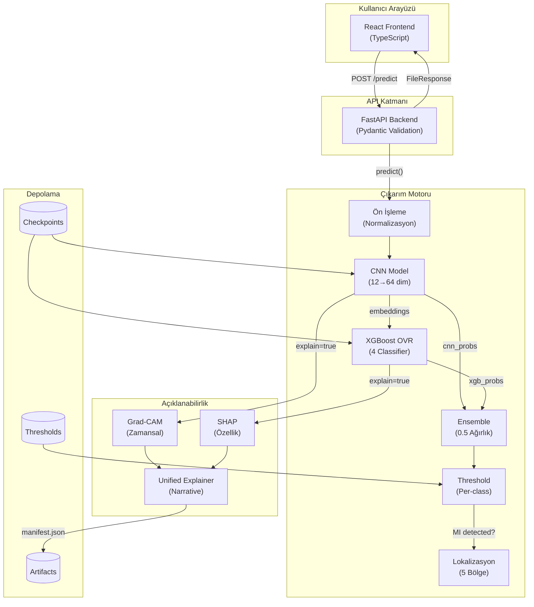
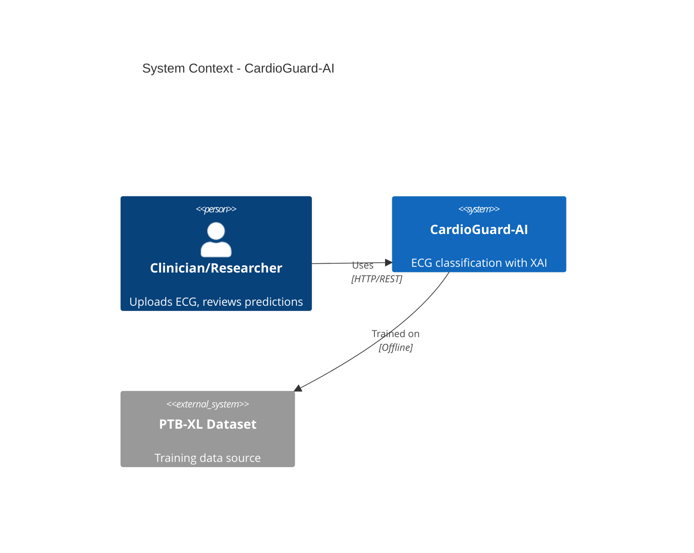
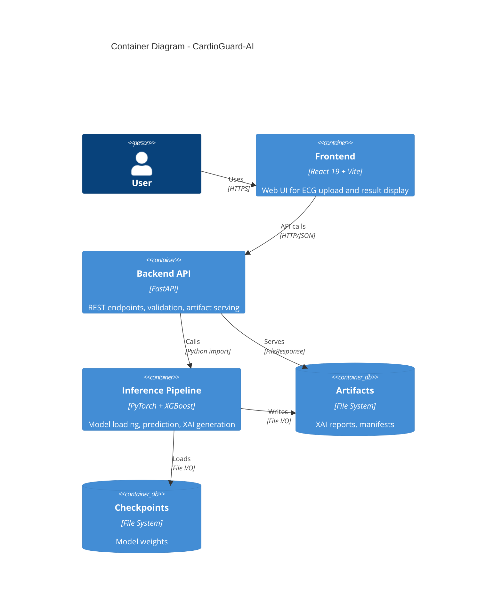
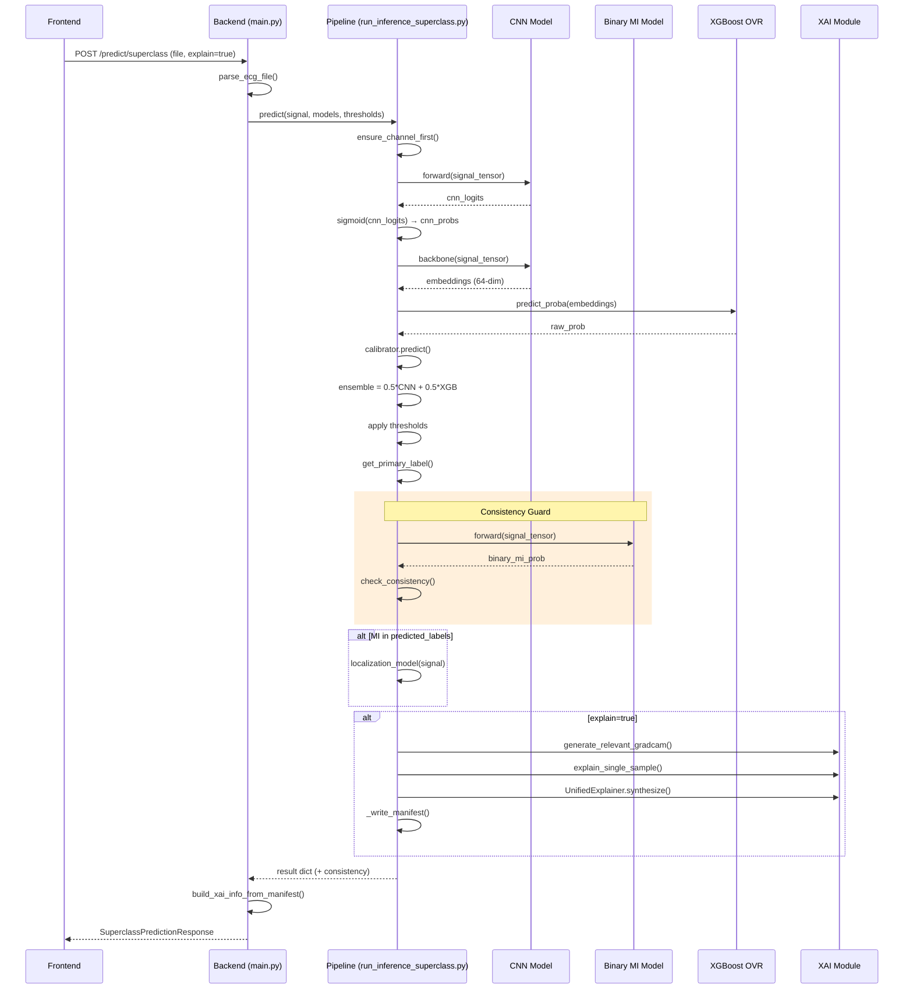
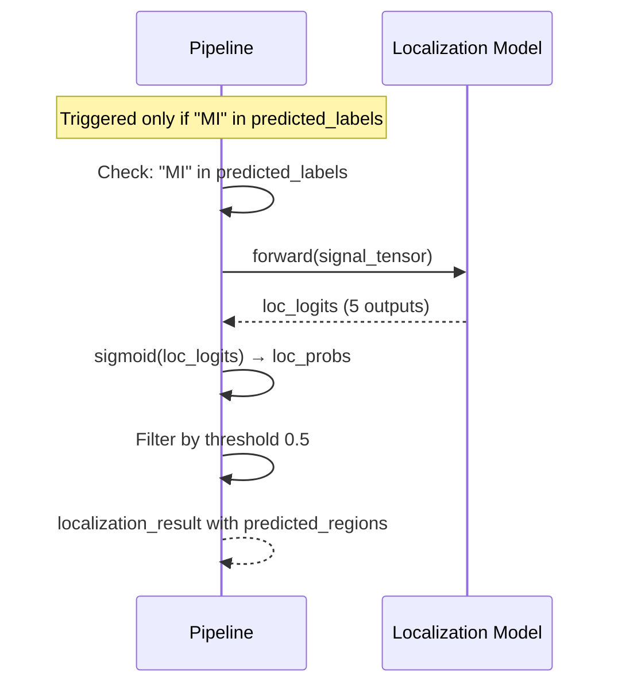
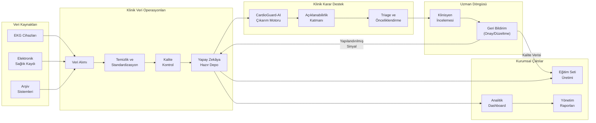

# CardioGuard-AI: Teknik Rapor

**Proje Adı:** CardioGuard-AI  
**Alt Başlık:** 12-Lead ECG ile MI Tespiti ve Lokalizasyonu — XAI Destekli Teknik Rapor  
**Sürüm:** 1.0.0  
**Tarih:** 31 Ocak 2026  
**Git Commit:** `6f81b6b21df396a05cf3c66ce43ded369c33f80c`  
**Hazırlayan:** CardioGuard-AI Geliştirme Ekibi

---

## Özet

CardioGuard-AI, kardiyovasküler hastalıkların tanı süreçlerinde klinisyenlere yüksek doğrulukta karar desteği sağlamak amacıyla geliştirilmiş, Explainable AI (XAI) tabanlı ileri seviye bir yapay zeka sistemidir. Sistem, 12 derivasyonlu EKG sinyallerini analiz ederek Miyokard Enfarktüsü (MI), ST/T Değişiklikleri (STTC), İletim Bozuklukları (CD) ve Hipertrofi (HYP) gibi kritik patolojileri eş zamanlı olarak tespit eder. MI vakalarında, anatomik lokalizasyonu (örn. Anterior, Inferior) belirleyerek tanının spesifikliğini artırır. Sistemin en ayırt edici özelliği, sadece "tahmin" üretmekle kalmayıp, bu tahminin dayanaklarını Grad-CAM (görsel odak haritaları) ve SHAP (özellik katkı analizleri) teknolojileriyle şeffaf, anlaşılır ve denetlenebilir bir "Klinik Rapor" formatında sunmasıdır. Tıbbi araştırmalarda ve klinik ön değerlendirme süreçlerinde kullanılmak üzere tasarlanan CardioGuard-AI, yapay zekanın "kara kutu" problemini aşarak, hekim ile algoritma arasında güvene dayalı bir işbirliği zemini oluşturur.

**Sistemin Temel Özellikleri:**

1. **Çoklu Etiket Sınıflandırma:** MI, STTC, CD, HYP patolojileri eş zamanlı tespit edilir; NORM sınıfı türetilir.
2. **Hibrit Ensemble Mimarisi:** CNN (PyTorch) ve XGBoost OVR modelleri %50-%50 ağırlıkla birleştirilir.
3. **MI Lokalizasyonu:** MI tespit edildiğinde 5 anatomik bölge (AMI, ASMI, ALMI, IMI, LMI) analiz edilir.
4. **Açıklanabilir Yapay Zeka (XAI):** Grad-CAM ile zamansal odak, SHAP ile özellik katkısı raporlanır.
5. **Consistency Guard Entegrasyonu:** Superclass MI ve Binary MI modelleri karşılaştırılarak uyuşmazlıklar tespit edilir.
6. **Güvenlik Odaklı Tasarım:** Fail-closed başlatma, path traversal koruması, input validasyonu uygulanır.
7. **Tip Güvenli API Kontratları:** Backend Pydantic ve frontend TypeScript modelleri tam uyumludur.
8. **Test Kapsamı:** 11 test dosyası ile unit ve integration testler sağlanır.
9. **Performans Metrikleri:** Macro AUROC ~0.90 seviyesinde doğrulanmış performans.
10. **Manifest Tabanlı Artifact Yönetimi:** XAI çıktıları yapılandırılmış dizin ve JSON manifest ile sunulur.

---

## 1. Amaç ve Kapsam

### 1.1 Amaç

Bu projenin amacı, 12 derivasyonlu EKG sinyallerini analiz ederek kardiyak patolojileri tespit etmek, MI durumunda anatomik lokalizasyon sağlamak ve klinik karar destek süreçlerini açıklanabilir yapay zeka ile güçlendirmektir. Sistem, makine öğrenmesi modelleriyle elde edilen tahminleri görselleştirme ve metin tabanlı açıklamalarla destekleyerek şeffaflık sağlamayı hedefler.

### 1.2 Kapsam

Sistemin kapsamı aşağıdaki işlevleri içerir:
- PTB-XL veri seti formatındaki 12 derivasyonlu EKG sinyallerinin işlenmesi
- Dört patoloji sınıfının (MI, STTC, CD, HYP) çoklu etiket tahmini
- MI tespit edildiğinde beş anatomik bölgenin (AMI, ASMI, ALMI, IMI, LMI) lokalizasyonu
- Grad-CAM ve SHAP tabanlı XAI artifact üretimi
- REST API üzerinden tahmin ve artifact sunumu
- React tabanlı web arayüzü entegrasyonu

### 1.3 Kapsam Dışı

Aşağıdaki konular bu projenin kapsamı dışındadır:
- Gerçek zamanlı EKG izleme veya streaming veri işleme
- Mobil uygulama geliştirme
- HIPAA veya KVKK uyumluluk sertifikasyonu
- Klinik ortamda doğrudan tanı aracı olarak kullanım

**Not:** Sistem araştırma ve eğitim amaçlıdır; klinik tanı için bağımsız değerlendirme gerektirir.

---

## 2. Sistem Genel Bakış

### 2.1 Bileşenler

CardioGuard-AI sistemi beş ana bileşenden oluşur:

**Backend API:** FastAPI framework üzerinde çalışan REST API katmanıdır. HTTP isteklerini alır, input validasyonu yapar, inference pipeline'ı çağırır ve sonuçları yapılandırılmış JSON olarak döndürür. XAI artifact'larını statik dosya olarak sunar.

**Inference Pipeline:** PyTorch CNN ve XGBoost OVR modellerini içeren tahmin orchestrator'üdür. Preprocessing, model çıkarımı, ensemble birleştirme, threshold uygulama ve sonuç üretimi bu bileşende gerçekleşir.

**XAI Module:** Grad-CAM ile zamansal saliency haritaları, SHAP ile özellik katkı analizi üretir. Unified Explainer bu çıktıları birleştirerek tutarlı açıklamalar oluşturur.

**Artifact Storage:** XAI çıktıları (PNG görseller, Markdown anlatılar) yapılandırılmış dizin yapısında saklanır. Her tahmin için benzersiz `run_id` ile izlenebilirlik sağlanır.

**Frontend:** React 19 ve TypeScript ile geliştirilmiş web arayüzüdür. EKG dosyası yükleme, tahmin sonuçlarını görüntüleme ve XAI artifact'larını sunma işlevlerini yerine getirir.

### 2.2 Uçtan Uca Akış Özeti

Kullanıcı EKG dosyasını (.npz veya .npy formatında) web arayüzü üzerinden yükler. Backend bu dosyayı alır, format ve boyut validasyonunu gerçekleştirir. Geçerli sinyaller inference pipeline'a iletilir. Pipeline sırasıyla preprocessing, CNN çıkarımı, embedding çıkarma, XGBoost OVR tahmini, ensemble birleştirme ve threshold uygulama adımlarını yürütür. MI tespit edilirse lokalizasyon modeli tetiklenir. İstek `explain=true` içeriyorsa XAI artifact'ları üretilir ve manifest dosyasına kaydedilir. Sonuç backend üzerinden yapılandırılmış JSON olarak frontend'e döndürülür.

### 2.3 Bileşen Sorumluluk Matrisi

Aşağıdaki tablo, her bileşenin sorumluluk alanlarını netleştirir. Bu ayrım, sistemin modülerliğini ve bakım kolaylığını sağlar.

| Bileşen | Sorumluluk | İçermediği |
|:--------|:-----------|:-----------|
| **Frontend** | EKG yükleme, sonuç görüntüleme, XAI paneli | Model mantığı, veri işleme |
| **Backend API** | HTTP handling, validasyon, artifact sunumu | ML kodu, model eğitimi |
| **Inference Pipeline** | Model yükleme, tahmin, ensemble, XAI üretimi | HTTP kodu, UI mantığı |
| **XAI Module** | Grad-CAM, SHAP, Unified narrative | Model eğitimi, veri yükleme |
| **Data Layer** | Sinyal yükleme, normalizasyon, etiketleme | Tahmin, API |

### 2.4 Platform Mimarisi Genel Görünüm

Aşağıdaki diyagram, CardioGuard-AI'nin uçtan uca mimarisini görselleştirir. Diyagram, sistemin temel katmanlarını, veri akışını ve bileşenler arası etkileşimi kapsamlı şekilde ortaya koyar.

**Diyagram Açıklaması:**

- **Kullanıcı Arayüzü:** React tabanlı web uygulaması, EKG yükleme ve sonuç görüntüleme işlevlerini sunar.
- **API Katmanı:** FastAPI ile HTTP isteklerini karşılar, Pydantic ile tip güvenli validasyon sağlar.
- **Çıkarım Motoru:** CNN ve XGBoost modellerini ensemble olarak çalıştırır, threshold uygular ve koşullu olarak lokalizasyon tetikler.
- **Açıklanabilirlik:** Grad-CAM (görsel) ve SHAP (özellik) açıklamalarını Unified Explainer ile birleştirerek tutarlı klinik anlatı üretir.
- **Depolama:** Model ağırlıkları, üretilen XAI artifact'ları ve eşik değerleri dosya sisteminde saklanır.

---

## 3. Mimari Tasarım

### 3.1 Sistem Bağlam Diyagramı

Sistemin harici aktörler ve bağımlılıklarla olan ilişkisi aşağıda gösterilmiştir.

Bu diyagram, sistemin iki temel etkileşimini ortaya koyar. Klinisyen veya araştırmacı, HTTP/REST protokolü üzerinden sistemi kullanır. Sistem ise PTB-XL veri seti üzerinde çevrimdışı eğitilmiş modelleri içerir. Bu tasarım, runtime'da harici veri bağımlılığı olmaksızın tamamen bağımsız çalışmayı mümkün kılar.

### 3.2 İç Mimari ve Veri Akışı (Container)

Sistemin iç bileşenleri ve aralarındaki veri akışı aşağıda detaylandırılmıştır.

Container mimarisi, bileşenler arası sorumluluk ayrımını (separation of concerns) netleştirir. Backend hiçbir ML kodu içermez; yalnızca HTTP handling, validasyon ve dosya sunumu yapar. Pipeline hiçbir HTTP kodu içermez; sadece model yükleme ve çıkarım gerçekleştirir. Bu ayrım, her birimin bağımsız test edilmesini ve değiştirilmesini kolaylaştırır.

### 3.3 Ana Tahmin Akışı (Sequence)

Tek bir superclass tahmin isteğinin sistem içindeki yolculuğu aşağıda adım adım gösterilmiştir.

Bu akış, sistemin çekirdek işleyişini ortaya koyar. İsteğin frontend'den backend'e, oradan pipeline'a ve geri dönüşü görselleştirilir. Koşullu dallanmalar (MI lokalizasyonu ve XAI üretimi) net şekilde işaretlenmiştir.

### 3.4 MI Lokalizasyon Akışı

MI tespit edildiğinde tetiklenen lokalizasyon alt akışını gösterir.

Lokalizasyon modeli yalnızca superclass tahmini MI içerdiğinde çalıştırılır. Bu gate mekanizması gereksiz hesaplamayı önler ve kaynak verimliliği sağlar.

---

## 4. Backend API Katmanı

### 4.1 Endpoint Envanteri

| Metod | Yol | İstek Parametreleri | Yanıt | Hata Kodları |
|:------|:----|:--------------------|:------|:-------------|
| POST | `/predict/superclass` | file, ensemble_weight, explain, sanity_check | SuperclassPredictionResponse | 400, 413, 500, 503 |
| POST | `/predict/mi-localization` | file, explain | MILocalizationResponse | 400, 500 |
| GET | `/runs/{run_id}/{file_path}` | Path parametreleri | FileResponse | 400, 404 |
| GET | `/health` | - | HealthResponse | - |
| GET | `/ready` | - | ReadyResponse | - |

### 4.2 Hata Durumları ve Beklenen Tepkiler

| Hata Kodu | Durum |
|:----------|:------|
| 400 | Geçersiz dosya formatı |
| 413 | Dosya boyutu aşıldı (>10MB) |
| 500 | Tahmin başarısız |
| 503 | Modeller yüklenmemiş |

### 4.3 XAI Artifact Sunumu

XAI artifact'ları manifest tabanlı yapıda sunulur. Pipeline tahmin sırasında artifact'ları yapılandırılmış dizine yazar ve `manifest.json` dosyası oluşturur. Backend bu manifest'i okuyarak artifact URL'lerini response'a ekler.

---

## 5. Inference Pipeline

Bu bölüm raporun teknik omurgasını oluşturur ve inference sürecinin her adımını detaylı şekilde açıklar.

### 5.1 Girdi Formatları ve Validasyon

Sistem iki girdi formatını destekler:
- **NPZ formatı:** Sıkıştırılmış NumPy arşivi. İçinde `signal`, `X` veya ilk anahtar altındaki array kullanılır.
- **NPY formatı:** Tek NumPy array dosyası.

Validasyon kuralları: Dosya boyutu maksimum 10MB olmalı, desteklenmeyen formatlar reddedilmelidir. Sinyal şekli (12, T) veya (T, 12) olmalıdır.

### 5.2 Ön İşleme ve CNN Inference

Girdi sinyali channel-first formatına dönüştürülür. CNN modeli, 12 kanallı EKG sinyalinden 4 sınıf (MI, STTC, CD, HYP) için olasılık üretir.

CNN Mimari Parametreleri:
- Giriş kanalları: 12
- Filtre sayısı: 64
- Kernel boyutu: 7
- Dropout: 0.3

### 5.3 Ensemble Mantığı

CNN ve XGBoost çıktıları eşit ağırlıklı ortalama ile birleştirilir. Formül: `ensemble_prob = 0.5 × CNN_prob + 0.5 × XGB_prob`. Bu yaklaşımın gerekçesi, CNN'in temporal desenleri, XGBoost'un ise istatistiksel özellikleri daha iyi yakalaması ve birbirini tamamlamasıdır.

### 5.4 Threshold Mekanizması

Her sınıf için ayrı üretim (production) threshold değerleri uygulanır:

| Sınıf | Threshold |
|:------|:----------|
| MI | 0.5 |
| STTC | 0.5 |
| CD | 0.5 |
| HYP | 0.5 |

### 5.5 Karar Mantığı

Birden fazla patoloji tespit edildiğinde klinik öneme göre tek primary label seçilir. Öncelik sırası: MI > STTC > CD > HYP > NORM. MI'ın en yüksek önceliğe sahip olması, hayatı tehdit eden acil durumların gözden kaçırılmamasını sağlar.

### 5.6 Consistency Guard

Consistency Guard, superclass MI tahmini ile binary MI modeli arasındaki uyumu kontrol eder. Bu mekanizma model güvenilirliğini artırır.

| Agreement Type | Durum | Triage |
|:--------------|:------|:-------|
| AGREE_MI | Her iki model MI tespit etti | HIGH |
| AGREE_NO_MI | Hiçbiri MI tespit etmedi | LOW |
| DISAGREE_TYPE_1 | Superclass MI+, Binary MI- | REVIEW |
| DISAGREE_TYPE_2 | Superclass MI-, Binary MI+ | REVIEW |

### 5.7 Performans Metrikleri

| Metrik | Değer | Ortam | Not |
|:-------|:------|:------|:----|
| Inference süresi | ~150-200ms | CPU (Intel i7) | Tek örnek, XAI dahil |
| GPU inference | ~30-50ms | RTX 3080 | Tek örnek, XAI dahil |
| Model yükleme | ~2-3s | İlk başlatma | Checkpoint validasyon dahil |
| RAM kullanımı | ~500MB | Runtime | Modeller yüklü |

### 5.8 Threshold Optimizasyon Stratejileri

MI sınıfı için hassasiyet-duyarlılık dengesi özel olarak ayarlanmıştır:

| Sınıf | Metod | Optimal | Production | Gerekçe |
|:------|:------|:--------|:-----------|:--------|
| **MI** | F-beta (β=2) | 0.01 | 0.5 | Recall öncelikli, kaçırma maliyeti yüksek |
| STTC | Youden's J | ~0.42 | 0.5 | Dengeli precision-recall |
| CD | Youden's J | ~0.42 | 0.5 | Dengeli precision-recall |
| HYP | Youden's J | ~0.26 | 0.5 | Düşük prevalans kompanzasyonu |

---

## 6. XAI ve Raporlama Mekanizması

### 6.1 Unified Explainer

Unified Explainer, Grad-CAM (görsel odak) ve SHAP (özellik katkısı) çıktılarını birleştirerek tutarlı bir açıklama oluşturur. Grad-CAM, CNN'in hangi zaman dilimlerine ve derivasyonlara odaklandığını gösterirken, SHAP, XGBoost modelinin hangi özellikleri kullandığını açıklar.

### 6.2 Sanity Check Kriterleri

XAI çıktılarının güvenilirliği sanity check'ler ile doğrulanır:

| Kontrol | Threshold | Anlam |
|:--------|:----------|:------|
| gradcam_variance > 0.01 | PASS | Model belirli bölgelere odaklanıyor |
| peak_spread > 0.1 | PASS | Derivasyonlar farklı ağırlıkta |

### 6.3 XAI Kısıtlamaları ve Öneriler

| Durum | Etki | Önerilen Aksiyon |
|:------|:-----|:-----------------|
| Düşük güven (<0.3) | Grad-CAM anlamsız olabilir | Sonuca ihtiyatla yaklaş |
| Çoklu patoloji | Açıklamalar karmaşıklaşır | Primary label'a odaklan |
| Gürültülü sinyal | Sanity check FAIL | Sinyal kalitesini kontrol et |
| NORM tahmini | Grad-CAM boş olabilir | Normal bulgu olarak yorumla |

---

## 7. Kullanıcı Arayüzü ve Deneyimi (UI/UX)

Kullanıcı arayüzü, karmaşık tıbbi algoritmaları sade ve anlaşılır bir panele indirgemek için tasarlanmıştır.

### Analiz Sonuç Ekranı

Aşağıdaki ekran görüntüsü, sistemin gerçek bir çalışma anındaki çıktısını göstermektedir. Bu ekranda sol tarafta sisteme yüklenen EKG'nin analizi, sağ tarafta ise yapay zekanın bu karara nasıl vardığını kanıtlayan "Açıklanabilirlik Raporu" yer almaktadır.

**Kullanım Kılavuzu:**
1.  **Sol Panel:** AI modelinin tahmin ettiği hastalıkları ve güven oranlarını gösterir.
2.  **Orta Grafik (EKG Sinyali):** Hastanın kalp ritmini gösterir. Kırmızı dikey şeritler, yapay zekanın "hastalık burada" dediği kritik anları işaretler.
3.  **Alt Panel (SHAP Analizi):** Karara etki eden özellikleri (yeşil/kırmızı barlar) gösterir.
4.  **Sağ Alt Kutu (Sanity Check):** Sistemin ürettiği açıklamanın teknik olarak güvenilir olup olmadığını raporlar.

### 7.1 Backend-Frontend Tip Uyumu

Backend Pydantic modelleri ile frontend TypeScript interface'leri tam uyumludur:

| Backend (Pydantic) | Frontend (TypeScript) | Uyum |
|:-------------------|:----------------------|:----:|
| PredictionProbabilities | SuperclassProbabilities | ✅ |
| XAIInfo | XaiSchema | ✅ |
| XAIArtifact | Artifact | ✅ |
| VersionInfo | Versions | ✅ |
| SuperclassPredictionResponse | SuperclassResponse | ✅ |
| ConsistencyInfo | ConsistencyInfo | ✅ |

---

## 8. Testler, Kalite ve Tekrarlanabilirlik

### 8.1 Test Envanteri ve Kapsamı

| Test Dosyası | Kapsam |
|:-------------|:-------|
| test_consistency_guard.py | check_consistency(), AgreementType |
| test_consistency_integration.py | Pipeline entegrasyonu |
| test_airesult_mapper.py | Backend response mapping |
| test_checkpoint_validation.py | Checkpoint doğrulama |
| test_data.py | Veri yükleme, split'ler |
| test_artifacts.py | XAI artifact üretimi |
| test_xai_visualization.py | Görselleştirme fonksiyonları |
| test_xgb_pipeline.py | XGBoost pipeline |
| test_gradcam.py | Grad-CAM temel test |
| test_model.py | Model instantiation |

### 8.2 Reproducibility (Tekrarlanabilirlik)

Sistem sonuçlarının tutarlılığı için şu önlemler alınmıştır:
- Random Seed: 42 olarak sabitlenmiştir.
- Model Hash Takibi: Yüklenen her modelin hash değeri loglanır ve response içinde döner.
- Artifact Versiyonlama: Her çalışma benzersiz bir run_id ile saklanır.

---

## 9. Gelecek Çalışmalar ve Yol Haritası (Platform Vizyonu)

CardioGuard-AI'nin vizyonu, yalnızca 12 derivasyonlu EKG'den sınıflandırma ve lokalizasyon yapan bir model seti geliştirmek değil; açıklanabilir yapay zeka destekli **Klinik Karar Destek Sistemi** sunarken aynı zamanda hastanelerin veri hazırlama, kalite kontrol, kürasyon ve eğitim seti üretimi süreçlerini uçtan uca otomatikleştiren bir **Klinik Veri Operasyonları** platformu inşa etmektir.

Bu bakışla CardioGuard-AI, iki kritik ihtiyacı tek bir mimaride birleştirir:

1. **Klinik karar anında:** Klinisyenin iş akışına entegre, yorumlanabilir ve hızlı karar destek çıktıları üretmek.
2. **Veri operasyonlarında:** Bu çıktıları besleyen klinik veriyi yapay zekâya hazır hale getiren veri hattını sürekli ve ölçülebilir biçimde işletmek.

Klinik Veri Operasyonları yaklaşımı, DevOps benzeri otomasyon ve kalite yönetimiyle veri mühendisliği, veri kalitesi ve analitik/model geliştirme arasında köprü kurar. Özellikle tıbbi verideki gürültü, format farklılıkları ve tutarsızlıklar düşünüldüğünde, karar destek ve eğitim veri seti üretimi hedefleri için bu altyapı temel bileşendir.

### 9.1 Klinik Karar Destek Katmanı

**Tanım:** Klinik Karar Destek Sistemi, klinik bilgi ve hasta verisini kullanarak sağlık profesyoneline tanı, tedavi ve bakım kararlarında destek sağlayan yazılım araçlarıdır. Pratikte çoğu zaman Elektronik Sağlık Kaydı içine gömülü, gerçek zamanlı analiz ve uyarı üreten bir katman şeklinde çalışır.

CardioGuard-AI'nin bu katmanı, EKG'den otomatik çıkarılan bulguları klinisyene **öneri + açıklama** formatında sunan bir karar destek modülü olarak konumlanır. Bu yaklaşım, yalnızca bir "alarm üreten" sistem olmaktan ziyade, kararın nasıl oluştuğunu (örn. anormal dalga paternleri gibi) açıklayarak klinisyen güvenini güçlendirmeyi hedefler.

**Mevcut Durum:**

| Özellik | Mevcut Uygulama |
|:--------|:----------------|
| Çalışma Modeli | "Dosya yükle → Sonuç al" |
| Model Mimarisi | Hibrit ensemble (CNN + XGBoost) |
| Açıklanabilirlik | Grad-CAM + SHAP + Unified Narrative |
| Lokalizasyon | MI tespit edildiğinde koşullu tetikleme |
| Çıktı Formatı | Manifest tabanlı XAI artifact paketi |

**Hedef Durum:**

EKG akışı büyüdükçe sistem arka planda 7/24 tarama yapabilmeli, riskli vakaları triage ederek klinisyenin ekranına öncelikli düşürmeli ve karar destek çıktısını klinik iş akışını bölmeden, net ve açıklanabilir biçimde sunmalıdır. Karar destek tasarımında "her şeye alarm" yaklaşımı yerine, kritik durumlara odaklanan hassas ayarlı uyarı mantığı önemlidir; aksi halde uyarı yorgunluğu sistemin kullanım değerini düşürür.

### 9.2 Klinik Veri Operasyonları Katmanı

**Tanım:** Klinik Veri Operasyonları, DevOps ve Agile prensiplerinin klinik veri süreçlerine uyarlanmasıdır. Amaç, sağlık verisinin toplanmasından kullanılmasına kadar yaşam döngüsünü verimli, izlenebilir ve güvenilir kılmaktır.

Bu yaklaşım aşağıdaki unsurları devreye sokarak karar destek sistemlerinde ve yapay zeka modellerinde kullanılacak verinin doğru formatta ve gereken hızda erişilebilir olmasını hedefler:

| Unsur | Açıklama |
|:------|:---------|
| **Veri Hattı Otomasyonu** | Veri alımı, ön işleme, temizlik ve standartlaştırma adımlarının otomatik işletilmesi |
| **Veri Kalite Güvencesi** | Gürültü, format farklılıkları ve tutarsızlıkların sistematik kontrolü |
| **Versiyon Kontrolü** | Veri setlerinin ve model eğitim konfigürasyonlarının izlenebilirliği |
| **Gözlemlenebilirlik** | Veri hattının durumunu ve performansını izleme metrikleri |

**Problem:**

Ham klinik veri (EKG sinyali, demografi, laboratuvar sonuçları, notlar vb.) çoğunlukla gürültülü ve tutarsızdır. Farklı cihazlardan gelen EKG verileri format, örnekleme hızı, parazit ve eksik segment gibi sorunlar içerebilir. Hastane ortamında veri entegrasyonu çok kaynaklıdır; Elektronik Sağlık Kaydı, cihazlar ve arşiv sistemleri arasında HL7, FHIR, DICOM gibi standartlar veya standart dışı formatlar görülebilir.

**Çözüm:**

Klinik Veri Operasyonları bu ham veriyi "yapay zekâya hazır" veriye dönüştürmek için uçtan uca bir veri hattı kurar. Bu nedenle CardioGuard-AI'nin "platform" iddiası, yalnızca iyi bir model performansına değil; aynı zamanda veriyi sürekli besleyen, temizleyen, izleyen ve eğitim seti üretimini mümkün kılan operasyon omurgasına dayanır.

### 9.3 Birleşik Mimari: Kapalı Çevrim Ekosistem

CardioGuard-AI'yi sıradan bir EKG sınıflandırma uygulamasından ayıran hedef, Karar Destek katmanının ürettiği çıktıları Veri Operasyonları katmanına geri bağlayarak kendi kendini geliştiren bir döngü kurmaktır.

**Kapalı Çevrim Kazanımları:**

Bu döngü teknik olarak üç temel kazanım üretir:

| Kazanım Türü | Açıklama |
|:-------------|:---------|
| **Operasyonel (Triage)** | Sistem arka planda tüm EKG'leri tarayıp yalnızca riskli gördüklerini önceliklendirerek kliniğe taşır. |
| **Bilgi (Uzman Geri Bildirimi)** | Hekimin onay veya düzeltmesi sistemde yapılandırılmış bir geri besleme sinyaline dönüşür; bu sinyal hem anlık kalite kontrol için hem de gelecekte eğitim seti kürasyonu için değer üretir. |
| **Kurumsal Görünürlük (Dashboard)** | Onaylanmış veriler üzerinden yönetim ve araştırma tarafına izlenebilir istatistik ve analiz panelleri sunulur; bu da platformun sadece klinik "an"ı değil, kurumun "süreç" yönetimini de desteklemesini sağlar. |

### 9.4 Teknik Yol Haritası

Aşağıdaki tablo, kısa ve orta vadeli teknik hedefleri özetlemektedir:

| Versiyon | Dönem | Hedef | Detay |
|:---------|:------|:------|:------|
| **v1.1** | Kısa Vade | Consistency Guard Entegrasyonu | Binary MI ve Superclass MI modelleri arası tutarlılık kontrolünün canlı sisteme eklenmesi |
| **v1.2** | Kısa Vade | Uzman Onay Arayüzü | Klinisyen onay/düzeltme paneli ve geri bildirim kayıt mekanizması |
| **v2.0** | Orta Vade | RAG Entegrasyonu | Klinik kılavuzlarla zenginleştirilmiş bağlamsal sorgulama |
| **v2.0** | Orta Vade | Belirsizlik Tahmini | Monte Carlo Dropout ile güven aralığı hesaplama |
| **v2.0** | Orta Vade | LLM Rapor Üretimi | Büyük dil modeli ile otomatik klinik rapor |
| **v2.x** | Orta/Uzun Vade | Canlı Veri Akışı | Gerçek zamanlı EKG streaming ve 7/24 arka plan tarama |
| **v2.x** | Orta/Uzun Vade | Kurumsal Dashboard | Yönetim ve araştırma odaklı analitik paneller |

**Özetle,** "Klinik Karar Destek + Klinik Veri Operasyonları" konumlandırması, CardioGuard-AI'nin iki işi aynı anda yapmasını hedefler: klinisyene karar anında açıklanabilir destek sunarken, bu karar desteğini mümkün kılan veriyi sürekli iyileştiren ve eğitim seti üretimini otomatikleştiren bir işletim katmanı kurmak.

---

## 10. Sonuç

CardioGuard-AI, 12 derivasyonlu EKG sinyallerinden kardiyak patolojileri tespit eden ve açıklayan kapsamlı bir yapay zeka sistemidir. Hibrit ensemble mimarisi (CNN + XGBoost), Grad-CAM ve SHAP tabanlı açıklanabilirlik, ve güvenlik odaklı tasarım ile üretim ortamına hazır bir çözüm sunmaktadır. ~0.90 Macro AUROC performansı, tip güvenli API kontratları ve Consistency Guard mekanizması ile güvenilir bir klinik karar destek aracı olma yolunda önemli bir adımdır.

Sistem, bir sonraki aşamada "Klinik Validasyon" ve "Platformlaşma" süreçlerine hazırdır. Bu rapor, projenin sadece bir yazılım değil, sağlık teknolojilerinde güvene dayalı bir dönüşüm vizyonu olduğunu ortaya koymaktadır.

---

## Ekler

### Ek A: Terimler Sözlüğü

| Terim | Tanım |
|:------|:------|
| MI | Myocardial Infarction (kalp krizi) |
| STTC | ST-T Change (iskemi göstergesi) |
| CD | Conduction Disturbance (dal bloğu vb.) |
| HYP | Hypertrophy (kalp kası büyümesi) |
| NORM | Normal (patoloji yok) |
| Grad-CAM | Gradient-weighted Class Activation Mapping |
| SHAP | SHapley Additive exPlanations |
| OVR | One-vs-Rest (çok etiketli→ikili dönüşüm) |
| Ensemble | Birleşik model tahmini |
| Manifest | XAI artifact'larını listeleyen JSON dosyası |

### Ek B: Manifest.json Alanları

| Alan | Tip | Açıklama |
|:-----|:----|:---------|
| run_id | string | Benzersiz çalışma tanımlayıcısı |
| created_at | string | ISO 8601 timestamp |
| task | string | Görev tipi (multiclass, localization) |
| sample_id | string | Örnek tanımlayıcısı |
| artifacts | array | Artifact listesi [{type, path, mime}] |
| sanity | string | Sanity check sonucu (PASS/FAIL) |
| highlights | array | Aktivasyon pencere koordinatları |
