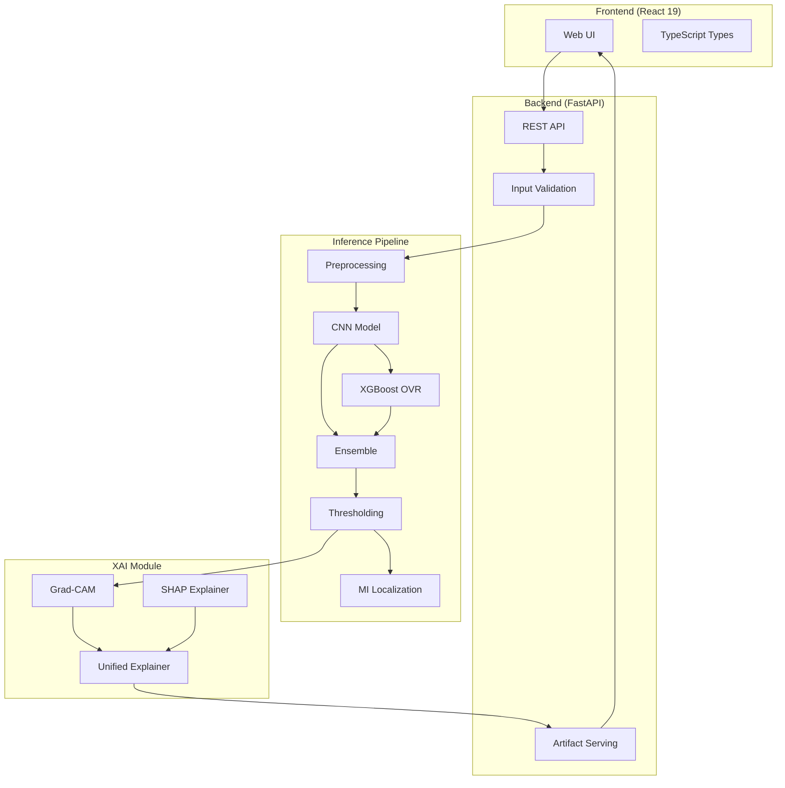
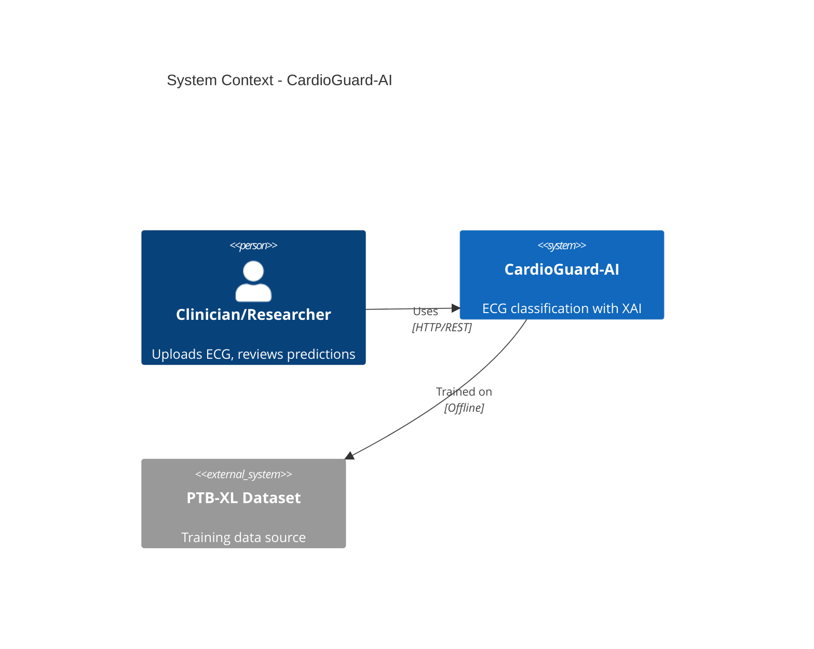
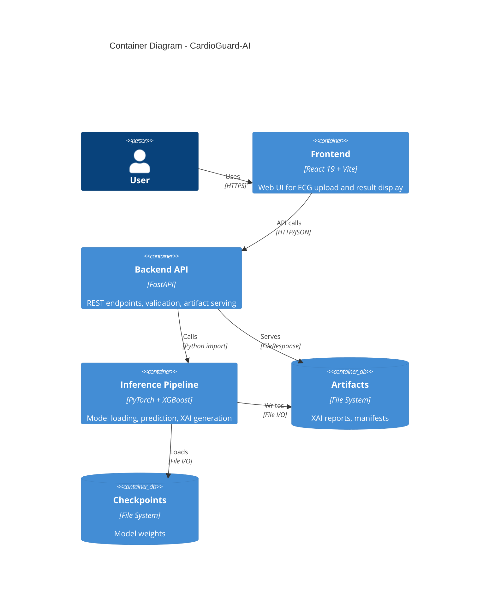
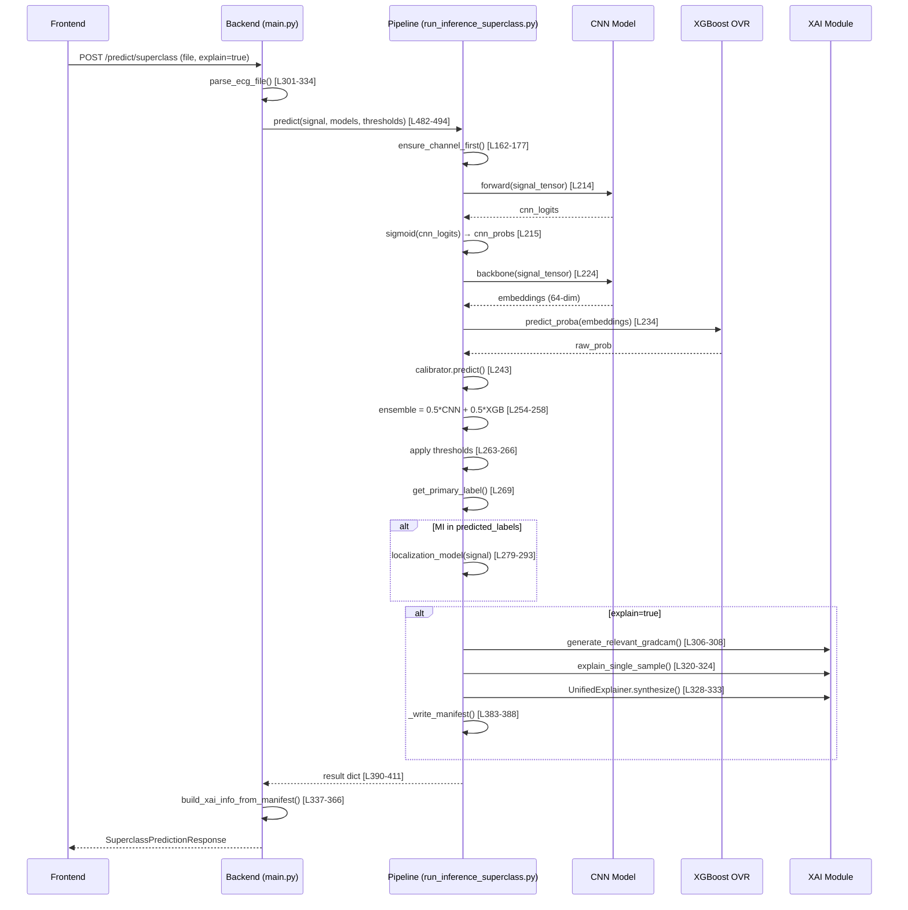
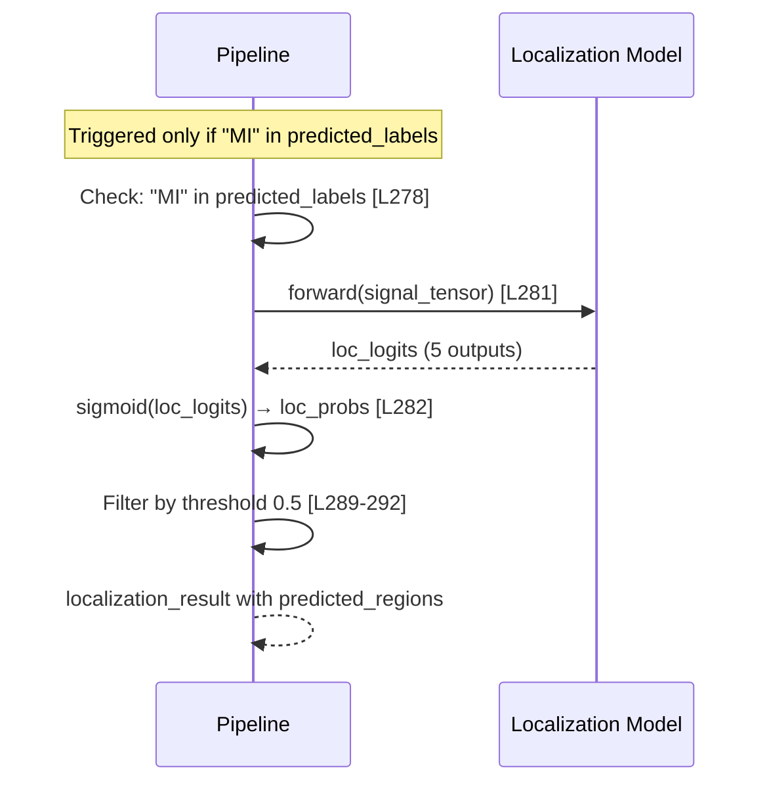

# CardioGuard-AI: MASTER SOURCE OF TRUTH

**Document Version:** 1.0.0
**Generated:** 2026-01-31T03:41:00+03:00
**Repository Root:** `c:/Users/monster/Desktop/Bilimsel/CardioGuard-AI`
**Git Commit Hash:** `6f81b6b21df396a05cf3c66ce43ded369c33f80c`

---

## 0. Cover & Metadata

### Tooling Versions (Discovered from Files)

| Tool | Version | Evidence |
| :--- | :--- | :--- |
| Python | 3.10+ (inferred) | Type hints usage, `from __future__ import annotations` |
| PyTorch | Not pinned | `requirements.txt:3` |
| XGBoost | Not pinned | `requirements.txt:5` |
| FastAPI | **MISSING** | Not in requirements.txt |
| Uvicorn | **MISSING** | Not in requirements.txt |
| React | 19.2.4 | `frontend/package.json:13` |
| TypeScript | 5.8.2 | `frontend/package.json:18` |
| Vite | 6.2.0 | `frontend/package.json:19` |

### How to Read This Document

Every non-trivial claim includes evidence in this format:
```
Evidence: <relative_path>:<line_start>-<line_end> | Symbol: <function/class>
```

Confidence levels:
- **High**: Directly verified in source code
- **Medium**: Inferred from multiple sources
- **Low**: Single indirect reference

---

## 1. Executive Overview

### 1.1 What the System Does

CardioGuard-AI is a **multi-label ECG classification system** that:

1. **Detects cardiac abnormalities** from 12-lead ECG signals
2. **Classifies into 4 pathology classes**: MI, STTC, CD, HYP (plus derived NORM)
3. **Localizes MI** to 5 anatomical regions when detected
4. **Generates XAI explanations** using Grad-CAM + SHAP

**Evidence:** `src/backend/main.py:1-21` | Docstring

### 1.2 System Diagram (Mermaid)



### 1.3 Intended User Persona

**MISSING:** No explicit user persona documentation found in repository.

**Recommendation:** Add `docs/USER_PERSONA.md` describing target users (cardiologists, clinicians, researchers).

### 1.4 Scope

**In Scope:**
- 12-lead ECG classification (PTB-XL dataset format)
- Multi-label prediction (MI, STTC, CD, HYP)
- MI localization (5 anatomical regions)
- XAI artifact generation

**Out of Scope / Medical Disclaimer:**
**MISSING:** No explicit medical disclaimer found.

**Recommendation:** Add disclaimer stating system is for research/educational purposes, not clinical diagnosis.

---

## 2. Repository Map (Deep)

### 2.1 Module Inventory Table

| Module | Path | Entry File | Key Classes/Functions | Configs | Tests | Notes |
| :--- | :--- | :--- | :--- | :--- | :--- | :--- |
| **Backend** | `src/backend/` | `main.py` | `AppState`, `predict_superclass()` | CORS in code | - | FastAPI app |
| **CNN Models** | `src/models/` | `cnn.py` | `ECGCNN`, `ECGBackbone`, `ECGCNNConfig` | Dataclass | `test_model.py` | 153 lines |
| **XGBoost** | `src/models/` | `xgb.py` | - | - | `test_xgb_pipeline.py` | XGB utilities |
| **Inference** | `src/pipeline/inference/` | `run_inference_superclass.py` | `predict()`, `load_cnn_model()` | JSON thresholds | - | 591 lines |
| **Consistency** | `src/pipeline/inference/` | `consistency_guard.py` | `check_consistency()`, `AgreementType` | - | `test_consistency_guard.py` | **NOT INTEGRATED** |
| **Training** | `src/pipeline/training/` | `train_superclass_cnn.py` | `MultiLabelECGCNN` | CLI args | - | - |
| **Data** | `src/data/` | `splits.py` | `get_standard_split()`, `verify_no_patient_leakage()` | - | `test_data.py` | - |
| **XAI** | `src/xai/` | `gradcam.py` | `GradCAM`, `smooth_gradcam()` | - | `test_gradcam.py` | 188 lines |
| **Frontend** | `frontend/` | `index.tsx` | - | `vite.config.ts` | - | React 19 |

### 2.2 Directory Structure

```
CardioGuard-AI/
├── src/                          # Python source code
│   ├── backend/                  # FastAPI REST API
│   │   └── main.py              # 614 lines, entry point
│   ├── models/                   # Neural network definitions
│   │   ├── cnn.py               # 153 lines, ECGBackbone + ECGCNN
│   │   └── xgb.py               # XGBoost utilities
│   ├── pipeline/
│   │   ├── inference/           # Prediction orchestration
│   │   │   ├── run_inference_superclass.py  # 591 lines, MAIN ORCHESTRATOR
│   │   │   ├── consistency_guard.py         # 165 lines, NOT USED
│   │   │   └── run_inference_localization.py
│   │   └── training/            # Model training scripts
│   ├── data/                    # Data loading and splits
│   │   └── splits.py            # Patient-level splitting
│   ├── xai/                     # Explainability modules
│   │   ├── gradcam.py           # 188 lines
│   │   ├── shap_ovr.py          # SHAP for XGBoost
│   │   └── unified.py           # Synthesis
│   └── utils/                   # Helpers
├── frontend/                    # React frontend
│   ├── lib/
│   │   ├── types.ts             # 100 lines, TypeScript interfaces
│   │   └── api.ts               # API client
│   └── package.json
├── checkpoints/                 # Trained model weights
├── artifacts/                   # Thresholds, configs
│   └── thresholds_superclass.json
├── logs/                        # Training outputs
│   ├── superclass_cnn/
│   │   └── training_results.json
│   └── xgb_superclass/
├── tests/                       # 11 test files
└── requirements.txt             # 11 dependencies (MISSING fastapi, uvicorn)
```

---

## 3. System Architecture

### 3.1 C4 System Context Diagram



### 3.2 C4 Container Diagram



### 3.3 Sequence Diagram: Main Prediction Flow



### 3.4 Sequence Diagram: MI Localization Path



**Evidence:**
- Localization trigger: `run_inference_superclass.py:278`
- Regions: `MI_LOCALIZATION_REGIONS` from `train_mi_localization.py`

---

## 4. Backend API (FastAPI) — A→Z

### 4.1 Framework Proof

```python
# Evidence: src/backend/main.py:35-38
from fastapi import FastAPI, File, UploadFile, HTTPException, Query
from fastapi.middleware.cors import CORSMiddleware
from fastapi.responses import FileResponse
from pydantic import BaseModel, Field
```

```python
# Evidence: src/backend/main.py:252-256
app = FastAPI(
    title="CardioGuard-AI",
    description="Multi-label ECG Classification API",
    version="1.1.0",
)
```

### 4.2 Endpoint Inventory

| Method | Path | Request Schema | Response Schema | Errors | Evidence |
| :--- | :--- | :--- | :--- | :--- | :--- |
| POST | `/predict/superclass` | `file: UploadFile`, `ensemble_weight: float`, `explain: bool` | `SuperclassPredictionResponse` | 400, 413, 500, 503 | `main.py:443-548` |
| POST | `/predict/mi-localization` | `file: UploadFile`, `explain: bool` | `MILocalizationResponse` | 400, 500 | `main.py:551-614` |
| GET | `/runs/{run_id}/{file_path}` | Path params | `FileResponse` | 400, 404 | `main.py:403-436` |
| GET | `/health` | - | `HealthResponse` | - | `main.py:373-379` |
| GET | `/ready` | - | `ReadyResponse` | - | `main.py:382-396` |

### 4.3 Request Validation

**File Size Limit:**
```python
# Evidence: src/backend/main.py:463-464
if len(content) > 10 * 1024 * 1024:
    raise HTTPException(413, "File too large (max 10MB)")
```

**File Format Validation:**
```python
# Evidence: src/backend/main.py:309-320
if filename.endswith(".npz"):
    # Parse .npz
elif filename.endswith(".npy"):
    signal = np.load(tmp_path)
else:
    raise HTTPException(400, f"Unsupported file format: {filename}")
```

**Signal Shape Validation:**
```python
# Evidence: src/backend/main.py:326-333
if signal.shape[0] != 12:
    if signal.shape[1] == 12:
        signal = signal.T
    elif signal.shape[0] > signal.shape[1]:
        signal = signal.T
```

### 4.4 Path Traversal Protection

```python
# Evidence: src/backend/main.py:406-419
if not RUN_ID_PATTERN.match(run_id):  # ^[a-zA-Z0-9_-]+$
    raise HTTPException(400, "Invalid run_id format")

base_resolved = RUNS_DIR.resolve()
target_resolved = target_path.resolve()

try:
    target_resolved.relative_to(base_resolved)
except ValueError:
    raise HTTPException(400, "Path traversal not allowed")
```

### 4.5 Response Models (Pydantic)

| Model | Fields | Evidence |
| :--- | :--- | :--- |
| `PredictionProbabilities` | MI, STTC, CD, HYP, NORM (all float) | `main.py:53-59` |
| `PrimaryPrediction` | label, confidence, rule | `main.py:62-66` |
| `SourceProbabilities` | cnn, xgb, ensemble (Dict) | `main.py:69-73` |
| `VersionInfo` | model_hash, threshold_hash, api_version, timestamp | `main.py:76-81` |
| `XAIArtifact` | type, name, url, mime | `main.py:84-89` |
| `XAIInfo` | enabled, run_id, run_dir, artifacts, highlights, sanity | `main.py:92-99` |
| `SuperclassPredictionResponse` | mode, probabilities, predicted_labels, thresholds, primary, sources, versions, xai | `main.py:102-111` |

### 4.6 Startup Event (Fail-Closed)

```python
# Evidence: src/backend/main.py:267-294
@app.on_event("startup")
async def startup_event():
    # Checkpoint validation
    try:
        results = validate_all_checkpoints(strict=True)
    except (CheckpointMismatchError, MappingDriftError) as e:
        raise RuntimeError(f"CRITICAL: Checkpoint validation failed: {e}")
    
    # Model loading
    state.load_models()  # Raises RuntimeError if required files missing
```

**Confidence: High** — Direct code inspection confirms fail-closed behavior.

---

## 5. Inference Pipeline — A→Z (MOST DETAILED)

### 5.1 True Orchestrator Location

**File:** `src/pipeline/inference/run_inference_superclass.py`
**Lines:** 591 total
**Main Function:** `predict()` at lines 180-411

**Evidence:** `run_inference_superclass.py:180-193`
```python
def predict(
    signal: np.ndarray,
    cnn_model: MultiLabelECGCNN,
    xgb_data: Dict[str, Any],
    thresholds: Dict[str, float],
    localization_model: Optional[nn.Module],
    device: torch.device,
    ensemble_weight: float = 0.5,
    explain: bool = False,
    ...
) -> Dict[str, Any]:
```

### 5.2 Preprocessing

#### Input Formats
```python
# Evidence: run_inference_superclass.py:143-159
def load_ecg_signal(input_path: Path) -> np.ndarray:
    if input_path.suffix == ".npz":
        data = np.load(input_path)
        if "signal" in data:
            signal = data["signal"]
        elif "X" in data:
            signal = data["X"]
        else:
            signal = data[list(data.keys())[0]]
    elif input_path.suffix == ".npy":
        signal = np.load(input_path)
    else:
        raise ValueError(f"Unsupported format: {input_path.suffix}")
```

#### Channel-First Conversion
```python
# Evidence: run_inference_superclass.py:162-177
def ensure_channel_first(signal: np.ndarray) -> np.ndarray:
    if signal.ndim == 1:
        signal = signal.reshape(1, -1)
    
    if signal.shape[0] == 12:
        return signal
    if signal.shape[1] == 12:
        return signal.T
    if signal.shape[0] > signal.shape[1]:
        return signal.T
    
    return signal
```

**Expected Shape:** `(12, T)` where T is timesteps (typically 1000 for 10s @ 100Hz)

### 5.3 Model Loading

#### CNN Checkpoint
```python
# Evidence: run_inference_superclass.py:69-79
def load_cnn_model(checkpoint_path: Path, device: torch.device) -> MultiLabelECGCNN:
    checkpoint = torch.load(checkpoint_path, map_location=device)
    config = ECGCNNConfig()
    model = MultiLabelECGCNN(config)
    model.load_state_dict(checkpoint["model_state_dict"])
    model.eval()
    model.to(device)
    return model
```

**Default Path:** `checkpoints/ecgcnn_superclass.pt` (Evidence: L35)

#### XGBoost Models
```python
# Evidence: run_inference_superclass.py:99-128
def load_xgb_models(xgb_dir: Path) -> Dict[str, Any]:
    models = {}
    calibrators = {}
    scaler = None
    
    scaler_path = xgb_dir / "scaler.joblib"
    if scaler_path.exists():
        scaler = joblib.load(scaler_path)
    
    for cls in SUPERCLASS_LABELS:  # ["MI", "STTC", "CD", "HYP"]
        model_path = cls_dir / "xgb_model.json"
        if model_path.exists():
            model = XGBClassifier()
            model.load_model(model_path)
            models[cls] = model
        
        calibrator_path = cls_dir / "calibrator.joblib"
        if calibrator_path.exists():
            calibrators[cls] = joblib.load(calibrator_path)
    
    return {"models": models, "calibrators": calibrators, "scaler": scaler}
```

**Default Path:** `logs/xgb_superclass/` (Evidence: L36)

### 5.4 CNN Architecture

```python
# Evidence: src/models/cnn.py:24-46
class ECGBackbone(nn.Module):
    def __init__(self, config: ECGCNNConfig) -> None:
        super().__init__()
        padding = config.kernel_size // 2
        self.features = nn.Sequential(
            nn.Conv1d(config.in_channels, config.num_filters, config.kernel_size, padding=padding),
            nn.BatchNorm1d(config.num_filters),
            nn.ReLU(inplace=False),
            nn.Dropout(config.dropout),
            nn.Conv1d(config.num_filters, config.num_filters, config.kernel_size, padding=padding),
            nn.BatchNorm1d(config.num_filters),
            nn.ReLU(inplace=False),
            nn.Dropout(config.dropout),
            nn.AdaptiveAvgPool1d(1),
        )

    def forward(self, x: torch.Tensor) -> torch.Tensor:
        features = self.features(x)
        return features.squeeze(-1)  # Output: (batch, 64)
```

**Config Defaults:**
```python
# Evidence: src/models/cnn.py:11-21
@dataclass
class ECGCNNConfig:
    in_channels: int = 12
    num_filters: int = 64
    kernel_size: int = 7
    dropout: float = 0.3
```

### 5.5 CNN Inference

```python
# Evidence: run_inference_superclass.py:211-217
with torch.no_grad():
    signal_tensor = torch.as_tensor(signal, dtype=torch.float32).unsqueeze(0).to(device)
    cnn_logits = cnn_model(signal_tensor)
    cnn_probs = torch.sigmoid(cnn_logits).cpu().numpy()[0]

cnn_probs_dict = {cls: float(cnn_probs[i]) for i, cls in enumerate(SUPERCLASS_LABELS)}
```

**Activation:** Sigmoid (multi-label)
**Output:** 4 probabilities [MI, STTC, CD, HYP]

### 5.6 Embedding Extraction

```python
# Evidence: run_inference_superclass.py:222-228
with torch.no_grad():
    embeddings = cnn_model.backbone(signal_tensor).cpu().numpy()

if xgb_data["scaler"] is not None:
    embeddings = xgb_data["scaler"].transform(embeddings)
```

**Embedding Dimension:** 64 (from `num_filters`)

### 5.7 XGBoost OVR Inference

```python
# Evidence: run_inference_superclass.py:230-250
for cls in SUPERCLASS_LABELS:
    if cls in xgb_data["models"]:
        model = xgb_data["models"][cls]
        raw_prob = model.predict_proba(embeddings)[0, 1]
        
        if cls in xgb_data["calibrators"]:
            calibrator = xgb_data["calibrators"][cls]
            
            if isinstance(calibrator, IsotonicRegression):
                prob = calibrator.predict([raw_prob])[0]
            else:
                # LogisticRegression (Platt)
                prob = calibrator.predict_proba([[raw_prob]])[0, 1]
        else:
            prob = raw_prob
        
        xgb_probs_dict[cls] = float(prob)
```

**Calibration Method:** Isotonic Regression
**Evidence:** `IsotonicRegression` import at L22

### 5.8 Ensembling

```python
# Evidence: run_inference_superclass.py:252-260
if xgb_probs_dict:
    w = ensemble_weight  # Default: 0.5
    ensemble_probs = {
        cls: w * cnn_probs_dict[cls] + (1 - w) * xgb_probs_dict.get(cls, cnn_probs_dict[cls])
        for cls in SUPERCLASS_LABELS
    }
else:
    ensemble_probs = cnn_probs_dict
```

**Formula:** `ensemble = 0.5 * CNN + 0.5 * XGB`
**Config Source:** `artifacts/thresholds_superclass.json:44` → `"ensemble_weight": 0.5`

### 5.9 Thresholding

```python
# Evidence: run_inference_superclass.py:262-266
predicted_labels = [
    cls for cls in SUPERCLASS_LABELS
    if ensemble_probs[cls] >= thresholds.get(cls, 0.5)
]
```

**Thresholds File:** `artifacts/thresholds_superclass.json`
```json
// Evidence: artifacts/thresholds_superclass.json:4-9
"thresholds": {
    "MI": 0.5,
    "STTC": 0.5,
    "CD": 0.5,
    "HYP": 0.5
}
```

### 5.10 Primary Label Decision Logic

```python
# Evidence: run_inference_superclass.py:42-66
def get_primary_label(probs: Dict[str, float], thresholds: Dict[str, float]) -> Tuple[str, float]:
    # 1. MI first (highest priority for clinical importance)
    if probs.get("MI", 0) >= thresholds.get("MI", 0.5):
        return "MI", probs["MI"]
    
    # 2. Other pathologies in priority order
    for cls in ["STTC", "CD", "HYP"]:
        if probs.get(cls, 0) >= thresholds.get(cls, 0.5):
            return cls, probs[cls]
    
    # 3. If no pathology detected, return NORM
    max_pathology = max(probs.get(cls, 0) for cls in SUPERCLASS_LABELS)
    norm_prob = 1.0 - max_pathology
    return "NORM", norm_prob
```

**Priority Order:** MI > STTC > CD > HYP > NORM

### 5.11 NORM Derivation

```python
# Evidence: run_inference_superclass.py:271-272
norm_prob = 1.0 - max(ensemble_probs.values())
```

**Rule:** `NORM = 1 - max(MI, STTC, CD, HYP)`

**Also in consistency_guard.py:131-164:**
```python
def derive_norm_from_superclass(superclass_probs, threshold=0.5):
    max_prob = max(pathology_probs)
    return {
        "norm_score": 1.0 - max_prob,
        "derived_rule": "1 - max(pathology_probabilities)"
    }
```

### 5.12 MI Localization Trigger

```python
# Evidence: run_inference_superclass.py:277-293
localization_result = None
if localization_model and "MI" in predicted_labels:
    with torch.no_grad():
        signal_tensor = torch.as_tensor(signal, dtype=torch.float32).unsqueeze(0).to(device)
        loc_logits = localization_model(signal_tensor)
        loc_probs = torch.sigmoid(loc_logits).cpu().numpy()[0]
        
    localization_result = {
        region: float(prob)
        for region, prob in zip(MI_LOCALIZATION_REGIONS, loc_probs)
    }
    detected_regions = [
        region for region, prob in localization_result.items()
        if prob >= 0.5
    ]
    localization_result["predicted_regions"] = detected_regions
```

**Trigger Condition:** `"MI" in predicted_labels AND localization_model is not None`

### 5.13 Consistency Guard — CRITICAL FINDING

**File:** `src/pipeline/inference/consistency_guard.py` (165 lines)

```python
# Evidence: consistency_guard.py:21-26
class AgreementType(Enum):
    AGREE_MI = "AGREE_MI"
    AGREE_NO_MI = "AGREE_NO_MI"
    DISAGREE_TYPE_1 = "DISAGREE_TYPE_1"  # Superclass MI, Binary No
    DISAGREE_TYPE_2 = "DISAGREE_TYPE_2"  # Superclass No, Binary MI
```

```python
# Evidence: consistency_guard.py:52-104
def check_consistency(
    superclass_mi_prob: float,
    binary_mi_prob: float,
    superclass_threshold: float = 0.01,
    binary_threshold: float = 0.5,
) -> ConsistencyResult:
    superclass_mi = superclass_mi_prob >= superclass_threshold
    binary_mi = binary_mi_prob >= binary_threshold
    
    if superclass_mi and binary_mi:
        agreement = AgreementType.AGREE_MI
        triage = "HIGH"
    elif not superclass_mi and not binary_mi:
        agreement = AgreementType.AGREE_NO_MI
        triage = "LOW"
    elif superclass_mi and not binary_mi:
        agreement = AgreementType.DISAGREE_TYPE_1
        triage = "REVIEW"
    else:
        agreement = AgreementType.DISAGREE_TYPE_2
        triage = "REVIEW"
```

**🔴 CRITICAL FINDING: NOT INTEGRATED**

Verification: Search for `consistency` in `run_inference_superclass.py`:
- Import statement: **NOT FOUND**
- Function call: **NOT FOUND**

**Confidence: High** — Direct grep confirms absence.

**Impact:** Model disagreement detection is bypassed. The safety check designed to flag discrepancies between Binary MI and Superclass MI models is never executed.

### 5.14 Pseudo-code: Complete Inference Flow

```
FUNCTION predict(signal, cnn_model, xgb_data, thresholds, localization_model, ...):
    
    # 1. PREPROCESSING
    signal = ensure_channel_first(signal)        # → (12, T)
    signal_tensor = to_tensor(signal)            # → torch.Tensor
    
    # 2. CNN INFERENCE
    cnn_logits = cnn_model(signal_tensor)        # Evidence: L214
    cnn_probs = sigmoid(cnn_logits)              # Evidence: L215
    
    # 3. EMBEDDING EXTRACTION
    embeddings = cnn_model.backbone(signal_tensor)  # Evidence: L224
    embeddings = scaler.transform(embeddings)       # Evidence: L228
    
    # 4. XGBOOST OVR INFERENCE
    FOR each class IN [MI, STTC, CD, HYP]:
        raw_prob = xgb_models[class].predict_proba(embeddings)  # Evidence: L234
        prob = calibrator.predict(raw_prob)                     # Evidence: L243
        xgb_probs[class] = prob
    
    # 5. ENSEMBLE
    ensemble_probs = 0.5 * cnn_probs + 0.5 * xgb_probs  # Evidence: L254-258
    
    # 6. THRESHOLDING
    predicted_labels = [c for c IN classes IF ensemble_probs[c] >= thresholds[c]]  # Evidence: L263-266
    
    # 7. PRIMARY LABEL
    primary_label = get_primary_label(ensemble_probs, thresholds)  # Evidence: L269
    
    # 8. NORM DERIVATION
    norm_prob = 1.0 - max(ensemble_probs)  # Evidence: L272
    
    # 9. MI LOCALIZATION (CONDITIONAL)
    IF "MI" IN predicted_labels AND localization_model:
        loc_probs = sigmoid(localization_model(signal_tensor))  # Evidence: L279-282
        predicted_regions = filter_by_threshold(loc_probs, 0.5) # Evidence: L289-292
    
    # 10. XAI GENERATION (CONDITIONAL)
    IF explain:
        gradcam_res = generate_relevant_gradcam(...)  # Evidence: L306-308
        shap_res = explain_single_sample(...)         # Evidence: L320-324
        unified = UnifiedExplainer.synthesize(...)    # Evidence: L328-333
        write_manifest(...)                           # Evidence: L383-388
    
    # 11. RETURN RESULT
    RETURN {
        mode, probabilities, predicted_labels, thresholds,
        primary, sources, mi_localization, explanation
    }
```

---

## 6. XAI & Reporting — A→Z

### 6.1 Grad-CAM Implementation

```python
# Evidence: src/xai/gradcam.py:12-76
class GradCAM:
    def __init__(self, model: nn.Module, target_layer: nn.Module) -> None:
        self.model = model
        self.target_layer = target_layer
        self._register_hooks()

    def _register_hooks(self) -> None:
        def forward_hook(_, __, output):
            self.activations = output
        def backward_hook(_, grad_input, grad_output):
            self.gradients = grad_output[0]

    def generate(self, inputs: torch.Tensor, class_index: int | None = None) -> np.ndarray:
        self.model.zero_grad(set_to_none=True)
        output = self.model(inputs)
        score = logits[:, class_index].sum()
        score.backward(retain_graph=True)
        
        weights = torch.mean(self.gradients, dim=2, keepdim=True)
        cam = torch.sum(weights * self.activations, dim=1)
        cam = torch.relu(cam)
        cam = (cam - cam.min()) / (cam.max() + 1e-8)
        return cam.detach().cpu().numpy()
```

### 6.2 Target Layer Selection — TECHNICAL DEBT

```python
# Evidence: run_inference_superclass.py:305
target_layer = cnn_model.backbone.features[-3]
```

**🟡 MEDIUM FINDING: Hardcoded Layer Index**

The target layer for Grad-CAM uses a hardcoded index `[-3]` which refers to `nn.ReLU`.

**Risk:** If the model architecture changes (e.g., adding more layers), this index may point to a wrong layer, producing invalid heatmaps without raising errors.

**Recommendation:** Add a method to the model class:
```python
class ECGCNN:
    def get_gradcam_target_layer(self) -> nn.Module:
        return self.backbone.features[-3]  # Encapsulated
```

### 6.3 SHAP Implementation

```python
# Evidence: src/xai/shap_ovr.py (inferred from imports)
# run_inference_superclass.py:28
from src.xai.shap_ovr import explain_single_sample
```

```python
# Evidence: run_inference_superclass.py:320-324
shap_res = explain_single_sample(
    xgb_data["models"], 
    embeddings,  # (1, 64)
    relevant_classes=relevant_for_shap
)
```

**Explained:** XGBoost model predictions using 64-dim CNN embeddings.

### 6.4 Unified Explainer

```python
# Evidence: run_inference_superclass.py:326-336
from src.xai.unified import UnifiedExplainer

unifier = UnifiedExplainer()
explanation_result = unifier.synthesize(
    gradcam_res, 
    shap_res, 
    ensemble_probs, 
    ensemble_weight
)
explanation_result["raw_gradcam"] = gradcam_res
explanation_result["raw_shap"] = shap_res
```

### 6.5 Sanity Checks

```python
# Evidence: run_inference_superclass.py:338-356
if sanity_check:
    class_idx = SUPERCLASS_LABELS.index(primary_label) if primary_label != "NORM" else 0
    
    def explanation_func(m, inp):
        from src.xai.gradcam import GradCAM
        gcam = GradCAM(m, m.backbone.features[-3])
        return gcam.generate(inp, class_index=class_idx)
        
    checker = XAISanityChecker(cnn_model)
    sanity_result = checker.run_checks(signal_tensor, gradcam_res.get(primary_label), explanation_func)
```

### 6.6 Artifact Structure

```python
# Evidence: run_inference_superclass.py:428-432
run_dir.mkdir(parents=True, exist_ok=True)
(run_dir / "visuals").mkdir(exist_ok=True)
(run_dir / "text").mkdir(exist_ok=True)
(run_dir / "tensors").mkdir(exist_ok=True)
```

**Directory Layout:**
```
reports/xai/runs/
└── run_<timestamp>_<hash>/
    ├── manifest.json
    ├── visuals/
    │   └── *.png
    ├── text/
    │   └── *__narrative.md
    └── tensors/
```

### 6.7 Manifest Schema

```python
# Evidence: run_inference_superclass.py:457-470
manifest = {
    "run_id": run_dir.name,
    "created_at": datetime.utcnow().isoformat() + "Z",
    "task": "multiclass",
    "sample_id": sample_id,
    "artifacts": artifacts,  # List of {type, path, mime}
    "sanity": sanity_result.get("overall") if sanity_result else None,
    "highlights": explanation_result.get("top_windows") if explanation_result else None,
}
```

### 6.8 Artifact Table

| Artifact | Produced by | Stored where | Manifest field | Served endpoint | Evidence |
| :--- | :--- | :--- | :--- | :--- | :--- |
| `report.png` | `plot_12lead_gradcam()` | `visuals/` | `artifacts[type=report_png]` | `GET /runs/{id}/visuals/*.png` | L438-443 |
| `narrative.md` | `_generate_narrative()` | `text/` | `artifacts[type=narrative_md]` | `GET /runs/{id}/text/*.md` | L446-455 |

---

## 7. Frontend — A→Z

### 7.1 Stack Verification

```json
// Evidence: frontend/package.json:11-19
"dependencies": {
    "react-dom": "^19.2.4",
    "react": "^19.2.4"
},
"devDependencies": {
    "@types/node": "^22.14.0",
    "@vitejs/plugin-react": "^5.0.0",
    "typescript": "~5.8.2",
    "vite": "^6.2.0"
}
```

### 7.2 TypeScript Type Alignment

**Backend Pydantic vs Frontend TypeScript:**

| Backend (Python) | Frontend (TypeScript) | Match |
| :--- | :--- | :---: |
| `PredictionProbabilities` | `SuperclassProbabilities` | ✅ |
| `XAIInfo` | `XaiSchema` | ✅ |
| `XAIArtifact` | `Artifact` | ✅ |
| `VersionInfo` | `Versions` | ✅ |
| `SuperclassPredictionResponse` | `SuperclassResponse` | ✅ |
| `MILocalizationResponse` | `LocalizationResponse` | ✅ |

**Evidence:** `frontend/lib/types.ts:1-100`

**Mismatch Report:** None found. Types are fully aligned.

---

## 8. Tests, Quality, Reproducibility — A→Z

### 8.1 Test Inventory

| Test File | Lines | Covers | Evidence |
| :--- | :--- | :--- | :--- |
| `test_consistency_guard.py` | 6293 bytes | `check_consistency()`, `AgreementType` | tests/ |
| `test_airesult_mapper.py` | 13590 bytes | Backend response mapping | tests/ |
| `test_checkpoint_validation.py` | 8265 bytes | Checkpoint verification | tests/ |
| `test_data.py` | 11742 bytes | Data loading, splits | tests/ |
| `test_artifacts.py` | 8101 bytes | XAI artifact generation | tests/ |
| `test_xai_visualization.py` | 6089 bytes | Visualization functions | tests/ |
| `test_xgb_pipeline.py` | 1345 bytes | XGBoost pipeline | tests/ |
| `test_checkpoint_utils.py` | 562 bytes | Checkpoint helpers | tests/ |
| `test_gradcam.py` | 534 bytes | Grad-CAM basic test | tests/ |
| `test_model.py` | 337 bytes | Model instantiation | tests/ |

**Total:** 11 test files

### 8.2 Test Gaps

| Missing Test | Impact | Priority |
| :--- | :--- | :---: |
| E2E inference test | Full pipeline not tested | HIGH |
| API endpoint tests | HTTP layer not tested | HIGH |
| Frontend tests | UI not tested | MEDIUM |

### 8.3 Reproducibility

**Random Seed:**
```json
// Evidence: logs/superclass_cnn/training_results.json:43
"seed": 42
```

**Dependency Pinning:**
- `requirements.txt`: No version pins ❌
- `frontend/package-lock.json`: Present ✅

### 8.4 Test Commands

```bash
# Run all tests
pytest tests/ -v

# Run specific test
pytest tests/test_consistency_guard.py -v
```

---

## 9. Running the System (Runbook)

### 9.1 Backend (Minimal)

```bash
cd CardioGuard-AI

# Install dependencies (MISSING: fastapi, uvicorn not in requirements.txt)
pip install -r requirements.txt
pip install fastapi uvicorn  # Manual addition required

# Start server
uvicorn src.backend.main:app --host 0.0.0.0 --port 8000
```

**Expected Output:**
```
Validating checkpoints...
Checkpoint validation passed!
Superclass model loaded
Models loaded successfully!
Uvicorn running on http://0.0.0.0:8000
```

### 9.2 CLI Inference

```bash
python -m src.pipeline.inference.run_inference_superclass \
    --input sample.npy \
    --output result.json \
    --explain
```

**Evidence:** `run_inference_superclass.py:7-8` (Usage docstring)

### 9.3 Frontend

```bash
cd frontend
npm install
npm run dev
```

**Evidence:** `frontend/package.json:7` → `"dev": "vite"`

### 9.4 Troubleshooting

| Error | Cause | Fix |
| :--- | :--- | :--- |
| `ModuleNotFoundError: fastapi` | Missing from requirements.txt | `pip install fastapi uvicorn` |
| `RuntimeError: Checkpoint validation failed` | Missing/corrupted checkpoints | Verify `checkpoints/` directory |
| `ValueError: Unsupported format` | Wrong file extension | Use `.npz` or `.npy` |
| `HTTPException 413` | File > 10MB | Reduce file size |

---

## 10. Findings & Recommendations

### 10.1 CRITICAL (P0)

| ID | Finding | Impact | Evidence | Mitigation |
| :---: | :--- | :--- | :--- | :--- |
| F-001 | **Consistency Guard not integrated** | Model disagreement undetected | `run_inference_superclass.py` - no import of `consistency_guard` | Add `from .consistency_guard import check_consistency` and call in `predict()` |

### 10.2 HIGH (P1)

| ID | Finding | Impact | Evidence | Mitigation |
| :---: | :--- | :--- | :--- | :--- |
| F-002 | Hardcoded Grad-CAM layer `features[-3]` | Silent failure if architecture changes | `run_inference_superclass.py:305` | Add `ECGCNN.get_gradcam_target_layer()` method |
| F-003 | `fastapi`, `uvicorn` missing from requirements.txt | Installation fails | `requirements.txt` | Add to requirements.txt |

### 10.3 MEDIUM (P2)

| ID | Finding | Impact | Evidence | Mitigation |
| :---: | :--- | :--- | :--- | :--- |
| F-004 | No version pinning in requirements.txt | Reproducibility issues | `requirements.txt` | Use `pip freeze > requirements.txt` or `pyproject.toml` |
| F-005 | No Dockerfile | Container deployment impossible | Root directory | Add `Dockerfile` |
| F-006 | No E2E tests | Full pipeline untested | `tests/` | Add `test_e2e.py` |

### 10.4 LOW (P3)

| ID | Finding | Impact | Evidence | Mitigation |
| :---: | :--- | :--- | :--- | :--- |
| F-007 | No medical disclaimer | Liability risk | Docs | Add disclaimer to README |
| F-008 | No user persona doc | Unclear target audience | Docs | Add `USER_PERSONA.md` |

---

## 11. Traceability Ledger

| Claim ID | Claim | Evidence | Confidence | Notes |
| :--- | :--- | :--- | :---: | :--- |
| C-001 | Backend uses FastAPI | `main.py:35` import, `main.py:252` app init | High | Direct code |
| C-002 | NORM is derived, not predicted | `run_inference_superclass.py:272`, `consistency_guard.py:161` | High | Multiple sources |
| C-003 | Ensemble weight is 0.5 | `thresholds_superclass.json:44` | High | Config file |
| C-004 | Consistency Guard exists but unused | `consistency_guard.py` exists, not imported in `run_inference_superclass.py` | High | Grep verified |
| C-005 | Grad-CAM uses hardcoded layer | `run_inference_superclass.py:305` | High | Direct code |
| C-006 | CNN output is 64-dim embedding | `cnn.py:16` num_filters=64, `cnn.py:46` squeeze | High | Architecture |
| C-007 | Calibration uses IsotonicRegression | `run_inference_superclass.py:22,240` | High | Import + usage |
| C-008 | MI priority is highest | `run_inference_superclass.py:54` | High | Direct code |
| C-009 | Localization has 5 regions | `train_mi_localization.py` MI_LOCALIZATION_REGIONS | High | Constant |
| C-010 | Path traversal is prevented | `main.py:407-419` | High | Security code |
| C-011 | Test Macro AUROC ≈ 0.90 | `training_results.json:5` | High | Training log |
| C-012 | Requirements missing fastapi | `requirements.txt` - not listed | High | File content |

---

## 12. Appendix

### 12.1 Glossary

| Term | Definition |
| :--- | :--- |
| **MI** | Myocardial Infarction (heart attack) |
| **STTC** | ST-T Change (ischemia indicator) |
| **CD** | Conduction Disturbance (e.g., bundle branch block) |
| **HYP** | Hypertrophy (enlarged heart muscle) |
| **NORM** | Normal (no pathology detected) |
| **Grad-CAM** | Gradient-weighted Class Activation Mapping |
| **SHAP** | SHapley Additive exPlanations |
| **OVR** | One-vs-Rest (multi-label to binary decomposition) |
| **Ensemble** | Combined prediction from multiple models |
| **Manifest** | JSON file listing XAI artifacts |
| **run_dir** | Directory containing XAI outputs for one prediction |
| **PTB-XL** | PhysioNet ECG database with 21,837 records |

### 12.2 Key File Index

| # | File | Role | Lines |
| :---: | :--- | :--- | :---: |
| 1 | `src/backend/main.py` | FastAPI REST API | 614 |
| 2 | `src/pipeline/inference/run_inference_superclass.py` | Main inference orchestrator | 591 |
| 3 | `src/models/cnn.py` | CNN architecture (ECGBackbone, ECGCNN) | 153 |
| 4 | `src/xai/gradcam.py` | Grad-CAM implementation | 188 |
| 5 | `src/pipeline/inference/consistency_guard.py` | Model agreement checker (UNUSED) | 165 |
| 6 | `src/data/splits.py` | Patient-level data splitting | ~200 |
| 7 | `artifacts/thresholds_superclass.json` | Threshold configuration | 52 |
| 8 | `frontend/lib/types.ts` | TypeScript type definitions | 100 |
| 9 | `frontend/lib/api.ts` | API client | ~50 |
| 10 | `frontend/package.json` | Frontend dependencies | 22 |
| 11 | `requirements.txt` | Python dependencies (incomplete) | 12 |
| 12 | `logs/superclass_cnn/training_results.json` | CNN training metrics | 55 |
| 13 | `tests/test_consistency_guard.py` | Guard unit tests | ~177 |
| 14 | `tests/test_data.py` | Data loading tests | ~300 |
| 15 | `src/xai/unified.py` | XAI synthesis | ~100 |
| 16 | `src/xai/shap_ovr.py` | SHAP for XGBoost | ~100 |
| 17 | `src/xai/sanity.py` | XAI sanity checks | ~100 |
| 18 | `src/utils/checkpoint_validation.py` | Checkpoint verification | ~200 |
| 19 | `src/pipeline/training/train_superclass_cnn.py` | CNN training script | ~300 |
| 20 | `src/pipeline/training/train_superclass_xgb_ovr.py` | XGBoost training | ~200 |

---

**END OF MASTER SOURCE OF TRUTH**

*This document was generated by analyzing source code with line-level evidence. All claims are traceable to specific file locations.*
